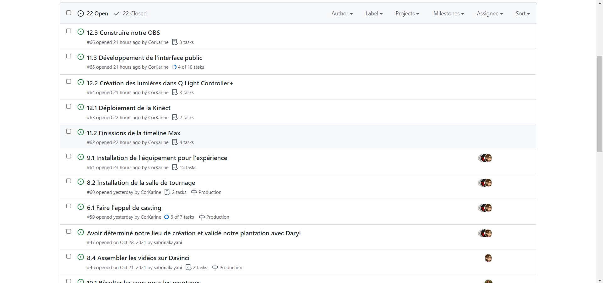
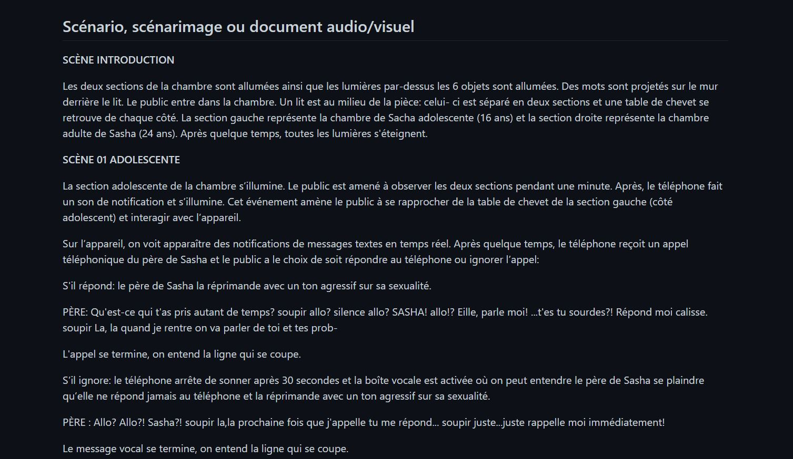
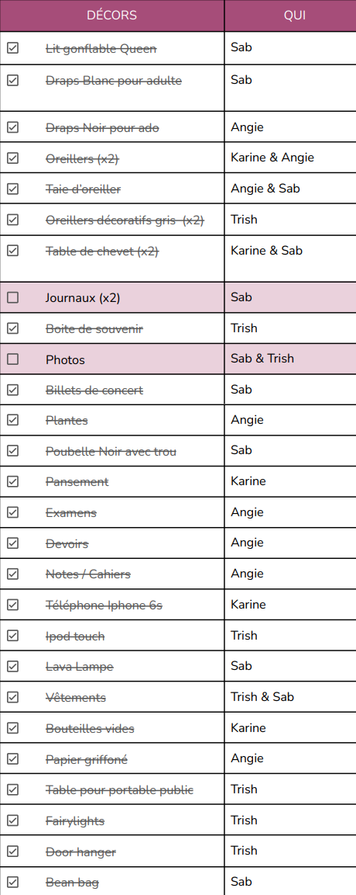

# Journal de création

## Semaine 9

## Semaine 8

## Semaine 7

## Semaine 6

## Semaine 5

## Semaine 4

## Semaine 3

## Semaine 2

## Semaine 1

Cette semaine fut le commencement de notre projet.

Tout d’abord, nous avions modifié la préproduction. En fait, nous avions modifié certains dialogues, les schémas de plantation, l'équipement et le tableau des contraintes techniques et potentiels problèmes de production. De plus, nous avions planifié les moments de rencontres de l'équipe. Ensuite, nous avions distribué les rôle au sein de l'équipe. Finalement, nous avions ajuster l'échéancier global.

Par la suite, nous avions fait une liste de tout les décors nécessaires pour notre installation dans un tableau. Nous avions passé à travers chaque item pour voir qui peut amener quel décors. 

Nous avons hâte de commencer à installer notre projet! :D

