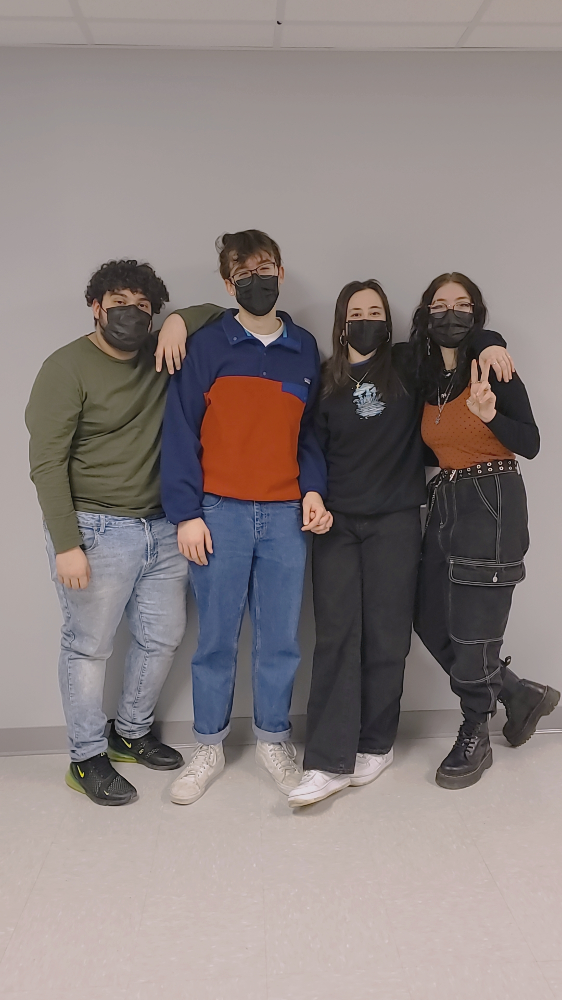
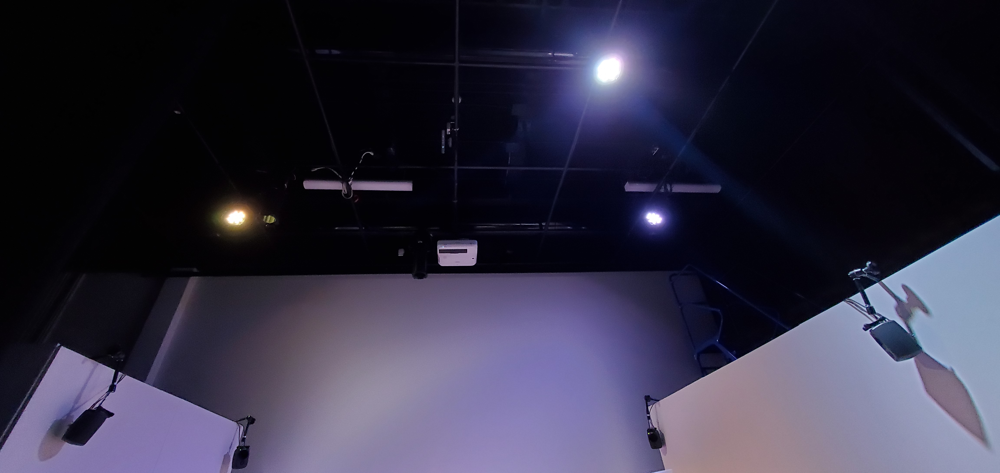
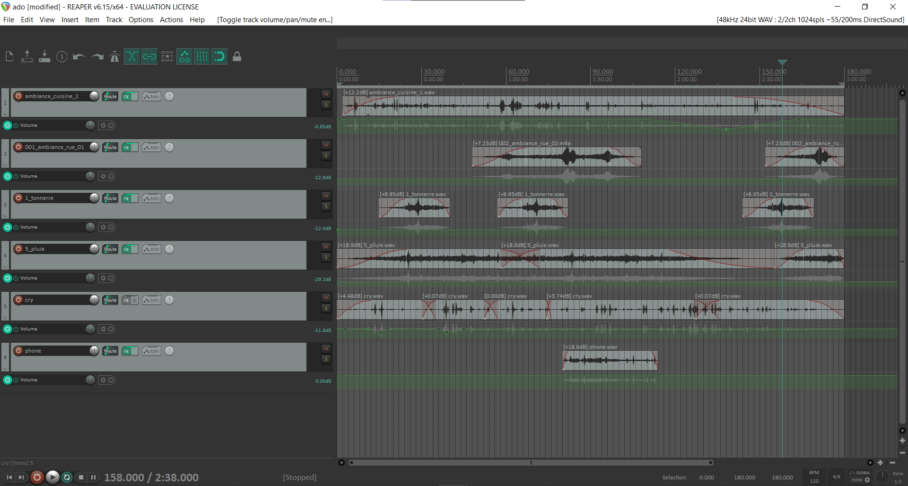

# Journal de création

## Semaine 9

## Semaine 8

## Semaine 6
Cette semaine, nous avons installé toutes les décorations des chambres.

Ensuite, nous avons filmé les deux scènes à projeter à l’aide des GOPRO.

Par la suite, nous avons terminé tous les montages sonores.

De plus, nous avons terminé tous les montages vidéos.

Aussi, nous avons ajouté les effets sonores des téléphones dans le code.

Finalement, nous avons décoré le journal adulte.

## Semaine de rattrapage
Cette semaine, nous avons fini l’enregistrement des doubleurs du père, de Sasha, du professeur et des camarades!

Tout d’abord, nous avons amené toutes les décorations nécessaires au tournage du samedi.

Ensuite, nous avons terminé d’installer tout l’équipement nécessaire à notre installation tels que les lumières et les haut-parleurs.

Par la suite, nous avons créé des lumières sur QLC plus pour notre jeu de lumière (chasser).

## Semaine 5
Cette semaine fut une semaine productive. Nous avons tout d’abord installé des haut-parleurs.

Ensuite, nous avons installé deux lumières ellipsoïdales au plafond.

Par la suite, nous avons enregistré 4 doubleurs et nous avons fait un test de spatialisation des voix sur Reaper.

De plus, les déclenchements sur Max on été testé. SF Play a été ajouté dans notre patch Max. Max est relié à QLC plus. OBS est relié à Spout.

Pour continuer, Trish a amené une boîte à souvenir à l’école ce qui a permis de tester le magnétique latch avec le code complété. 

Aussi, 6 pages de journal adolescent ont été écrites. De plus, les dessins pour le journal ont été dessinés. Finalement, le signet pour le journal a été créé. 

Nous avons hâte d'installer les décors de la chambre de Sasha!

## Semaine 4
Cette semaine nous avons commencé à installer l'équipement tels que le projecteur, la kinect et deux magics arms.

Ensuite, nous avons trouvé nos doubleurs pour le père, le professeur, Sasha et les camarades.

Par la suite, le magnétic latch a été soudé à l'arduino pour la boîte à souvenir.

Pour continuer, la musique pour la fin de notre installation a été créée.

Finalement, le journal adolescent est fini d'être rédigé et décoré.

## Semaine 3
Cette semaine nous avons emprunté l’équipement pour notre installation!

Ensuite, nous avons publié la nouvelle version de l’appel de casting sur le teams de TIM. Nous avons aussi affiché l’appel de casting sur les portes des locaux TIM!

Par la suite, les bandes ambiantes de la chambre adolescente, il reste juste à le spacialiser. De plus, la bande ambiante sonore de la chambre adulte a été commencée.

Pour continuer, l’action d’envoyer et de recevoir des messages avec le logiciel Max sont fonctionnels.

Ensuite, la kinect peut maintenant détecter la présence d’une personne et envoyer un message au logiciel Max!

Ensuite, les icônes pour les applications mobiles ont été créées avec adobe photoshop! 

Finalement, un scénario pour chaque vidéo projetée a été rédigé pour faciliter le tournage. 

Nous avons hâte d’installer l’équipement et d’amener les décorations au studio!

## Semaine 2
Cette semaine, nous avons modifié notre préproduction à la suite des commentaires de nos enseigants, notament le scénario.

Tout d'abord, les photos que nous allons imprimer pour placer dans la boîte à souvenir de Sasha ont été modifiées sur Photoshop.

Par la suite, la banière et l'image de couverture de notre projet ont été fait sur Photoshop. Nous avons aussi trouvé le titre de notre installation.

Ensuite, le CSS et le JS de l'interface mobile de Sasha adolescente a été complété. L'interface a été testée sur l'appareil mobile qui sera présent dans la chambre de Sasha. 

De plus, l'animation de la conclusion a été finalisée sur after effects. Elle a été peaufinée et des effets sonores ont été ajoutés à l'animation.

Finalement, le journal de Sasha adolescente a commencé à être rédiger à la main. Pour l'instant, 5 pages ont été transcrites dans le journal. 

## Semaine 1

Cette semaine fut le commencement de notre projet.

Tout d’abord, nous avons modifié la préproduction. En fait, nous avons modifié certains dialogues, les schémas de plantation, l'équipement et le tableau des contraintes techniques et potentiels problèmes de production. De plus, nous avons planifié les moments de rencontres de l'équipe. Ensuite, nous avons distribué les rôle au sein de l'équipe. Finalement, nous avons ajuster l'échéancier global.

Par la suite, nous avons fait une liste de tous les décors nécessaires pour notre installation dans un tableau. Nous avons passé à travers chaque item pour voir qui peut amener quel décors. 

Ensuite, les billets de concerts ont été créés et il reste qu'à les imprimer. De plus, le CSS pour l'interface d'envoie de message a commencé à être redigé. Par la suite, l'animation de la conclusion a été commencée. Il reste à la peaufiner et rajouter du son. Finalement, l'appel de casting a été redigé.

Nous avons hâte de commencer à installer notre projet! :D

