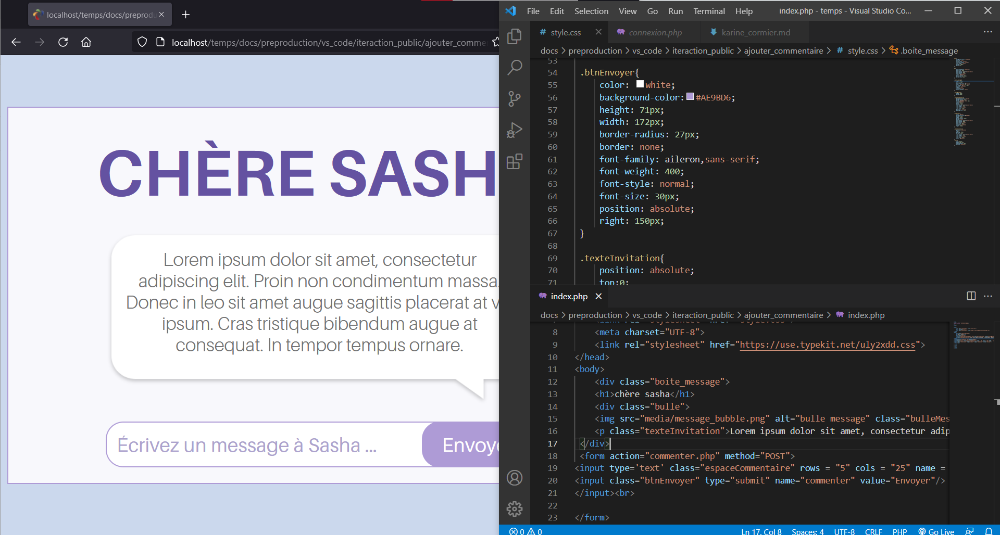

# Journal de création

## Semaine 9

## Semaine 8

## Semaine 7

## Semaine 6

## Semaine 5

## Semaine 4

## Semaine 3

## Semaine 2
Cette semaine, nous avons modifié notre préproduction à la suite des commentaires de nos enseigants, notament le scénario.

Tout d'abord, les photos que nous allons imprimer pour placer dans la boîte à souvenir de Sasha ont été modifiées sur Photoshop.

Par la suite, la banière et l'image de couverture de notre projet ont été fait sur Photoshop. Nous avons aussi trouvé le titre de notre installation.

Ensuite, le CSS et le JS de l'interface mobile de Sasha adolescente a été complété. L'interface a été testée sur l'appareil mobile qui sera présent dans la chambre de Sasha. 

De plus, l'animation de la conclusion a été finalisée sur after effects. Elle a été peaufinée et des effets sonores ont été ajoutés à l'animation.

Finalement, le journal de Sasha adolescente a commencé à être rédiger à la main. Pour l'instant, 5 pages ont été transcrites dans le journal. 

## Semaine 1

Cette semaine fut le commencement de notre projet.

Tout d’abord, nous avons modifié la préproduction. En fait, nous avons modifié certains dialogues, les schémas de plantation, l'équipement et le tableau des contraintes techniques et potentiels problèmes de production. De plus, nous avons planifié les moments de rencontres de l'équipe. Ensuite, nous avons distribué les rôle au sein de l'équipe. Finalement, nous avons ajuster l'échéancier global.

Par la suite, nous avons fait une liste de tous les décors nécessaires pour notre installation dans un tableau. Nous avons passé à travers chaque item pour voir qui peut amener quel décors. 

Ensuite, les billets de concerts ont été créés et il reste qu'à les imprimer. De plus, le CSS pour l'interface d'envoie de message a commencé à être redigé. Par la suite, l'animation de la conclusion a été commencée. Il reste à la peaufiner et rajouter du son. Finalement, l'appel de casting a été redigé.

Nous avons hâte de commencer à installer notre projet! :D

