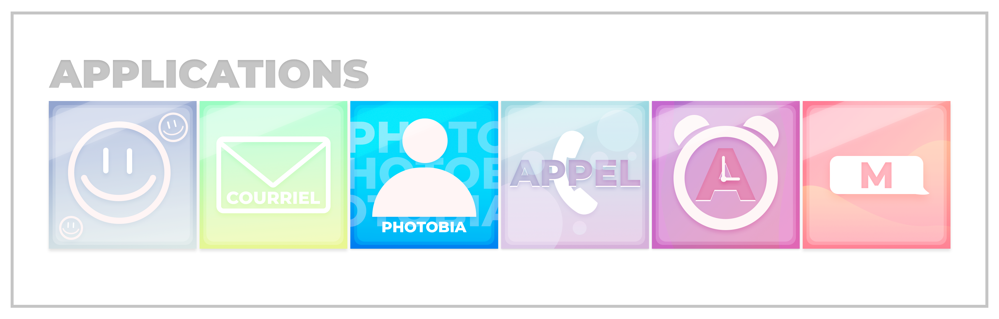
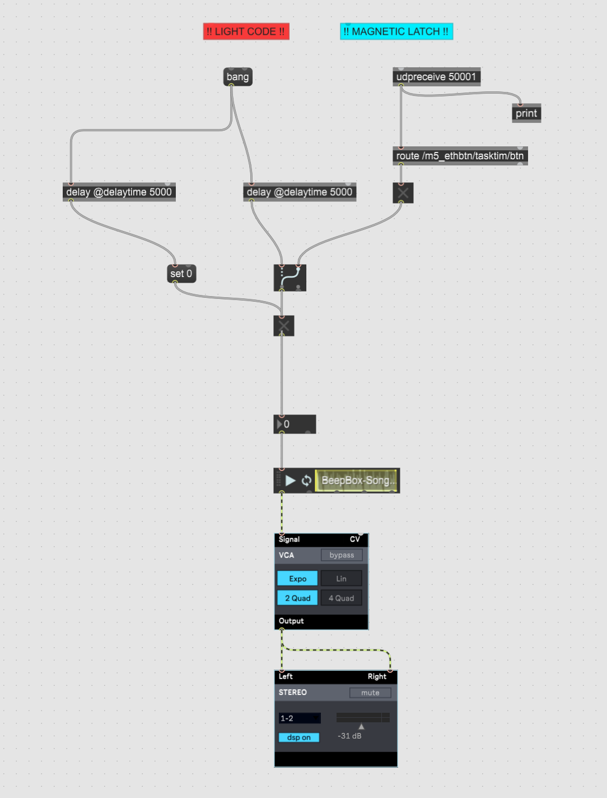

# Journal de Angelina De Silva Jeca

* [Semaine 1](#semaine-1)
* [Semaine 2](#semaine-2)
* [Semaine 3](#semaine-3)
* [Semaine 4](#semaine-4)
* [Semaine 5](#semaine-5)
* [Semaine de rattrapage](#semaine-de-rattrapage)
* [Semaine 6](#semaine-6)
* [Semaine 7](#semaine-7)
* [Semaine 8](#semaine-8)
* [Semaine 9](#semaine-9)

## Semaine 1

### Résumé des réalisations effectuées
-  Peaufiner la préproduction avec mes coéquipières
-  Écriture de l'appel de casting pour les voix et le personnage principal avec Trish
-  Déterminer les rôles au sein de l'équipe avec mes coéquipières
-  Ajout de contraintes dans le tableau de la préproduction
-  Récolte des éléments de décors
-  Modification de certains éléments de décors (notes, examens, dessins, cahier, etc)
-  Modification des éléments graphiques pour l'animation de la conclusion
-  Début de l'animation de la conclusion dans After Effects 
-  Préparation du journal individuel

### Image d'une réalisation dont tu es la ou le plus fier

### Est-ce que j'ai accompli l'ensemble des tâches et objectifs que je m'étais fixés pour cette semaine?	
- [x] Complètement
- [ ] Assez
- [ ] Peu
- [ ] Pas du tout

#### Décrivez pourquoi.
A l'aide d'une rencontre avec mes coéquipières le mercredi 26 janvier, nous avons été capable de peaufiner et de finaliser la préproduction. De plus, nous avons eu une rencontre le jeudi 27 janvier pour faire une liste des décors que nous possèdons et que nous devons acheter. Après notre rencontre du jeudi, j'ai pu continuer mes tâches personnelles tel que débuté l'animation et de modifier certains éléments de décors.

#### S'il y a lieu, qu'allez-vous faire pour remédier à la situation?
Ne s'applique pas

### Mon projet s'est-il réalisé selon l’échéancier prévu?

- [x] Complètement
- [ ] Assez
- [ ] Un peu
- [ ] Pas tout à fait

#### S'il y a des écarts, décrivez-les.
Ne s'applique pas

#### S'il y a lieu, qu'allez-vous faire pour remédier à la situation?
Ne s'applique pas

### Défis pour la prochaine semaine
- Finaliser la vidéo d'animation
- Créer l'audio pour la vidéo d'animation (son de bulle de messages)
- Exporter la vidéo d'animation
- Apprendre a faire fonctionner / utiliser la GoPro

---
## Semaine 2
### Résumé des réalisations effectuées
- Rencontre pour la pré-approbation de la préproduction
- Modification de la préproduction avec mes coéquipières 
- Peaufinement de la vidéo d'animation
- Apprentissage et tests de la GoPro 
- Dessins/griffonages pour le journal

### Image d'une réalisation dont tu es la ou le plus fier

### Est-ce que j'ai accompli l'ensemble des tâches et objectifs que je m'étais fixés pour cette semaine?

- [ ] Complètement
- [x] Assez
- [ ] Peu
- [ ] Pas du tout

#### Décrivez pourquoi.
Cette semaine, nous nous sommes rencontré à l'école plusieurs fois pour avancer notre projet. Lundi pour travailler sur nos tâches personnelles, mercredi pour la rencontre avec les profs et jeudi pour la rencontre du comité technique. De plus, à chaque jours, après les rencontres avec nos coéquipiers, j'essayais d'avancer le plus possible mes tâches personnelles pour pouvoir prendre de l'avance et essayer de travailler sur d'autres tâches.   

#### S'il y a lieu, qu'allez-vous faire pour remédier à la situation?
Je n'ai pas pu ajouter tous les sons voulu dans la vidéo, car il me manquait des sons. Je vais m'assurer de les enregistrer pour les ajouter a la vidéo d'animation pour pouvoir faire approuver l'animation de la conclusion.

### Mon projet s'est-il réalisé selon l’échéancier prévu?

- [x] Complètement
- [ ] Assez
- [ ] Un peu
- [ ] Pas tout à fait

#### S'il y a des écarts, décrivez-les.
Ne s'applique pas

#### S'il y a lieu, qu'allez-vous faire pour remédier à la situation?
Ne s'applique pas

### Défis pour la prochaine semaine
- Filmer la vidéo de la prépoduction  
- Commencer à apporter les décors dans le studio
- Ajouter les sons dans l'animation et exporter la vidéo
- Apprendre à utiliser la kinect
- Créer les logos d'application pour les notifications du cellulaire

---
## Semaine 3 
### Résumé des réalisations effectuées
- Enregistrement de la vidéo de préproduction 
- Modification appel de casting pour l'affichage et annonce Team
- Création de vecteurs pour le cellulaire
- Création des logos d'applications pour le cellulaire
- Début de la modification du patch Max pour la boîte à souvenirs
- Emprunt de l'équipement avec l'équipe
- Tests du projecteur

### Image d'une réalisation dont tu es la ou le plus fier

### Est-ce que j'ai accompli l'ensemble des tâches et objectifs que je m'étais fixés pour cette semaine?

- [ ] Complètement
- [x] Assez
- [ ] Peu
- [ ] Pas du tout

#### Décrivez pourquoi.
Nous nous sommes rencontré plusieurs fois vers 9h du matin pour travailler tous ensemble. Le lundi et mardi nous avons travaillé sur nos tâches personnelles, le mercredi nous avons assisté à la rencontre avec les profs et le jeudi nous avons assisté à la rencontre du comité technique et nous avons débuté l'emprunt du matériel.  

#### S'il y a lieu, qu'allez-vous faire pour remédier à la situation?
Je n'ai pas pu ajouter tous les sons voulus dans la vidéo. J'attends d'avoir les sons de la part de Trish pour les ajouter. 

### Mon projet s'est-il réalisé selon l’échéancier prévu?

- [x] Complètement
- [ ] Assez
- [ ] Un peu
- [ ] Pas tout à fait

#### S'il y a des écarts, décrivez-les.
Ne s'applique pas

#### S'il y a lieu, qu'allez-vous faire pour remédier à la situation?
Ne s'applique pas

### Défis pour la prochaine semaine
- Continuer la modification du patch Max pour la boite à souvenirs
- Apprendre à utiliser le magnetic latch
- Continuer à installer le matériel dans le studio
- Modifier l'animation suite aux demandes apporter à la préproduction (séparer le dernier message en plusieurs paragraphes)
---
## Semaine 4
### Résumé des réalisations effectuées
- Rencontres avec candidats pour le casting
- Modification des logos d'applications pour le cellulaire
- Continuation du patch Max 
- Écriture du texte pour l'envoie de messages à Sasha
- Écriture du texte pour les notifications du cellulaire
- Installation du matériel dans le studio (haut-parleurs, carte de son, etc)
- Modification de l'animation suite aux demandes apporter à la préproduction (séparer le dernier message en plusieurs paragraphes)

### Image d'une réalisation dont tu es la ou le plus fier

### Est-ce que j'ai accompli l'ensemble des tâches et objectifs que je m'étais fixés pour cette semaine?

- [x] Complètement
- [ ] Assez
- [ ] Peu
- [ ] Pas du tout

#### Décrivez pourquoi.
Tout au long de la semaine, notre équipe s'est rejoint dans le grand studio. On travaillait sur le projet de 9AM a 4PM, tous les jours, pour avancer le projet le plus possible. 

#### S'il y a lieu, qu'allez-vous faire pour remédier à la situation?
Ne s'applique pas

### Mon projet s'est-il réalisé selon l’échéancier prévu?

- [x] Complètement
- [ ] Assez
- [ ] Un peu
- [ ] Pas tout à fait

#### S'il y a des écarts, décrivez-les.
Ne s'applique pas

#### S'il y a lieu, qu'allez-vous faire pour remédier à la situation?
Ne s'applique pas

### Défis pour la prochaine semaine
- Continuer a installer le matériel dans le studio
- Commencer a apporter les éléments de décors
- Finir le patch Max pour la boite a souvenirs
---
## Semaine 5
### Résumé des réalisations effectuées
- Finition du patch Max pour la boite à souvenirs!!!!
- Apprentissage de la borne kiosque sur Windows pour l'envoie de messages à la fin
- Commencement du signet pour le journal coté adolescent
- Enregistrement pour le casting (camarade 1,3,4,5) 
- Installation du matériel dans le studio (haut-parleurs (magic-arms), etc)

### Image d'une réalisation dont tu es la ou le plus fier

### Est-ce que j'ai accompli l'ensemble des tâches et objectifs que je m'étais fixés pour cette semaine?

- [x] Complètement
- [ ] Assez
- [ ] Peu
- [ ] Pas du tout

#### Décrivez pourquoi.
Toute la semaine, notre équipe s'est rejoint dans le grand studio. On travaillait sur le projet de 9AM à 4PM, tous les jours, pour avancer le projet le plus possible. 

#### S'il y a lieu, qu'allez-vous faire pour remédier à la situation?
Ne s'applique pas

### Mon projet s'est-il réalisé selon l’échéancier prévu?

- [x] Complètement
- [ ] Assez
- [ ] Un peu
- [ ] Pas tout à fait

#### S'il y a des écarts, décrivez-les.
Ne s'applique pas

#### S'il y a lieu, qu'allez-vous faire pour remédier à la situation?
Ne s'applique pas

### Défis pour la prochaine semaine
- Adapter le code Max de la boite à souvenirs à la timeline
- Finir le signet pour le journal coté adolescent
- Continuer l'installation
- Amener des décors (plantes, cahier, etc)
- Terminer le branchement du plafond
- Finir l'enregistrement des voix 
- Conceptualiser des affiches
---
## Semaine de rattrapage
### Résumé des réalisations effectuées
- Placement des tables de chevet
- Décoration de la poubelle (sauf qu'a cause du concierge, ça doit être refait)
- Finition du signet adolescent
- Amener des décors
- Enregistrement des voix
- Croquis et début de la conceptualisation des affcihes

### Image d'une réalisation dont tu es la ou le plus fier

### Est-ce que j'ai accompli l'ensemble des tâches et objectifs que je m'étais fixés pour cette semaine?

- [x] Complètement
- [ ] Assez
- [ ] Peu
- [ ] Pas du tout

#### Décrivez pourquoi.
Tout au long de la semaine, notre équipe s'est rejoint dans le grand studio. On travaillait sur le projet de 9AM a 4PM, pour avancer le projet le plus possible. 

#### S'il y a lieu, qu'allez-vous faire pour remédier à la situation?
Ne s'applique pas

### Mon projet s'est-il réalisé selon l’échéancier prévu?

- [x] Complètement
- [ ] Assez
- [ ] Un peu
- [ ] Pas tout à fait

#### S'il y a des écarts, décrivez-les.
Ne s'applique pas

#### S'il y a lieu, qu'allez-vous faire pour remédier à la situation?
Ne s'applique pas

### Défis pour la prochaine semaine
- Finir la conceptualisation des affiches
- Filmer pour les projections de l'installation
- Faire le montage vidéo
- Décorer l'installation
---
## Semaine 6
### Résumé des réalisations effectuées
- Tournage pour les projections de l'installation
- Décoration de l'installation
- Finition conceptualisation des affiches
- Finition montage vidéo 

### Image d'une réalisation dont tu es la ou le plus fier

### Est-ce que j'ai accompli l'ensemble des tâches et objectifs que je m'étais fixés pour cette semaine?

- [x] Complètement
- [ ] Assez
- [ ] Peu
- [ ] Pas du tout

#### Décrivez pourquoi.
Tout au long de la semaine, nous nous sommes rejoins dans le grand studio pour continuer à travailler sur le projet. 

#### S'il y a lieu, qu'allez-vous faire pour remédier à la situation?
Ne s'applique pas

### Mon projet s'est-il réalisé selon l’échéancier prévu?

- [x] Complètement
- [ ] Assez
- [ ] Un peu
- [ ] Pas tout à fait

#### S'il y a des écarts, décrivez-les.
Ne s'applique pas

#### S'il y a lieu, qu'allez-vous faire pour remédier à la situation?
Ne s'applique pas

### Défis pour la prochaine semaine
- Faire des dessins pour ajouter de la décoration du coté adolescent
- Placer l'ordinateur dans la salle des matrices
- Tester le tout ensemble
- Faire modification s'il y a lieu 
---
## Semaine 7
### Résumé des réalisations effectuées
- Décoration du mur adolescent
- Modification de l'ambiance sonore adulte suite aux recommendations du professeur
- Transfert de l'ordinateur dans la salle des matrices
- Modification des lumières dans QLC+ (pour les faire pulser) 

### Image d'une réalisation dont tu es la ou le plus fier

### Est-ce que j'ai accompli l'ensemble des tâches et objectifs que je m'étais fixés pour cette semaine?

- [x] Complètement
- [ ] Assez
- [ ] Peu
- [ ] Pas du tout

#### Décrivez pourquoi.
Tout au long de la semaine, nous nous sommes rejoins dans le grand studio pour continuer à travailler sur le projet. De plus, certaines journées, nous avons resté plus longtemps que prévue.  

#### S'il y a lieu, qu'allez-vous faire pour remédier à la situation?
Ne s'applique pas

### Mon projet s'est-il réalisé selon l’échéancier prévu?

- [ ] Complètement
- [ ] Assez
- [ ] Un peu
- [ ] Pas tout à fait

#### S'il y a des écarts, décrivez-les.
Ne s'applique pas

#### S'il y a lieu, qu'allez-vous faire pour remédier à la situation?
Ne s'applique pas

### Défis pour la prochaine semaine
- Filmer et monter la vidéo pour le vernissage de la semaine 8

