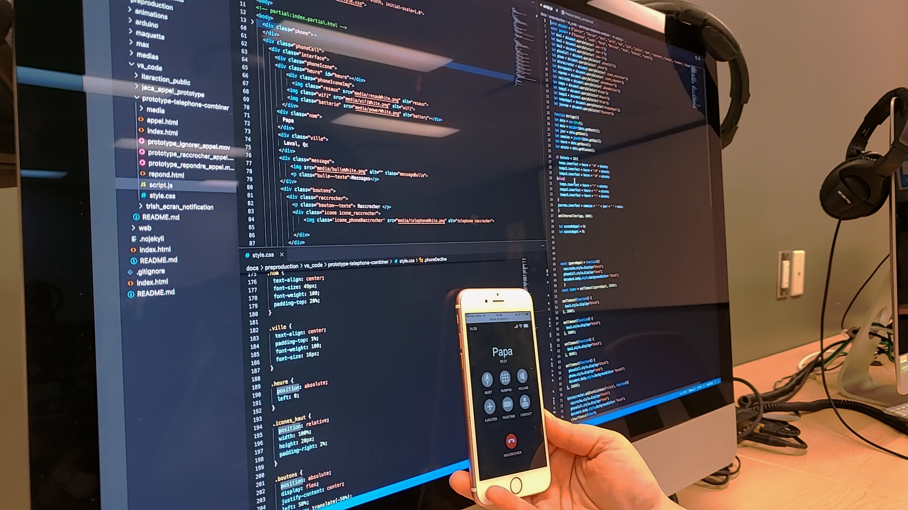
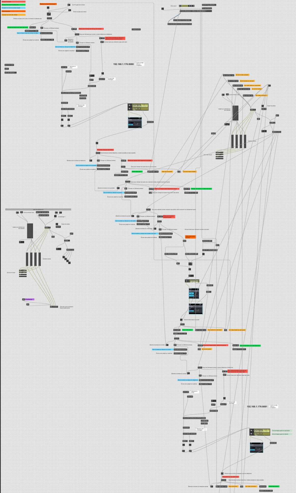

# Journal de Karine Cormier

* [Semaine 1](#semaine-1)
* [Semaine 2](#semaine-2)
* [Semaine 3](#semaine-3)
* [Semaine 4](#semaine-4)
* [Semaine 5](#semaine-5)
* [Semaine de rattrapage](#semaine-de-rattrapage)
* [Semaine 6](#semaine-6)
* [Semaine 7](#semaine-7)
* [Semaine 8](#semaine-8)
* [Semaine 9](#semaine-9)

## Semaine 1

### Résumé des réalisations effectuées
- Mise en ligne de notre site Web 
- Démarrage du projet 
- Finission du CSS de l'endroit où le public entre leurs messages
- Rennomer et classer les issues dans GitHub
- Retravailler la préproduction

### Image d'une réalisation dont tu es la ou le plus fier

### Est-ce que j'ai accompli l'ensemble des tâches et objectifs que je m'étais fixés pour cette semaine?	
- [x] Complètement
- [ ] Assez
- [ ] Peu
- [ ] Pas du tout

#### Décrivez pourquoi. 
Nous avons eu une rencontre mercredi qui nous a permis de compléter et retravailler la préproduction. De mon côté, j'ai retravailler sur les issues en les regroupant ensemble avec des numéro, les renommer et inscrire des sous-tâches à chacun. Aussi, jeudi nous avons retravailler la plantation et le schéma technique, de discuter du budget et des objets que chacun a déjà en sa possession. Pour finir, le jeudi matin, j'ai programmer la partie CSS où le public est invité à envoyer des messages à Sasha.

### Mon projet s'est-il réalisé selon l’échéancier prévu?

- [x] Complètement
- [ ] Assez
- [ ] Un peu
- [ ] Pas tout à fait

### Défis pour la prochaine semaine
Enregistrer la vidéo-conférence de la préproduction. Aussi, je voudrait avoir fini le CSS des notifications, de l'appel et de lorsque le public répond au téléphone de l'adolescente.

---
## Semaine 2
### Résumé des réalisations effectuées
- Finnission du CSS de l'interface cellulaire
- Adaptatin de l'interface pour un des téléphones (iPhone 6s)
- Ajouter le JavaScript pour aller a l'appel et utiliser les boutons
- Ajouter l'heure et le temps de l'appel en temps réel

### Image d'une réalisation dont tu es la ou le plus fier

### Est-ce que j'ai accompli l'ensemble des tâches et objectifs que je m'étais fixés pour cette semaine?

- [x] Complètement
- [ ] Assez
- [ ] Peu
- [ ] Pas du tout

#### Décrivez pourquoi.
Nous avons pris une rencontre vendredi pour filmer la vidéoconférence. Aussi, nous sommes venue à l'école lundi pour travailler sur nos partie séparé, mercredi pour notre rencontre avec les proffesseurs et jeudi pour le comité technique. Après toutes ces rencontres ainsi que mardi, j'ai travailler de chez moi sur les interfaces mobiles et tester avec github pages sur mon cellulaire pour voir comment le site s'adapte.

#### S'il y a lieu, qu'allez-vous faire pour remédier à la situation?

### Mon projet s'est-il réalisé selon l’échéancier prévu?

- [x] Complètement
- [ ] Assez
- [ ] Un peu
- [ ] Pas tout à fait

### Défis pour la prochaine semaine
Faire en sorte que le JavaScript se déclenche avec un bouton et puisse tourner en boucle. Aussi faire en sorte de lire la page grace à un téléphone qui se connecte avec l'adresse ip. Aussi, faire fonctionner la kinect et filmer notre vidéoconférence.

---
## Semaine 3 
### Résumé des réalisations effectuées
- Le JavaScript de la page peut jouer en boucle
- La page se déclenche avec un bouton Max
- Un bouton sur la page Web envoie un message à Max
- Un cellulaire peut se connecter sur le site, envoyer et recevoir les message Max
- Il est possible de cencoriser des mots pour l'interaction public
- Faire fonctionner la kinect et envoyer des messages dans le PureData d'un autre ordinateur qui envoie ensuite dans Max
- Filmer la vidéoconférence finale
- Faire l'emprunt du matériel
- Tester les dimensions du projecteur et son espace entre le plancher et le sol
- Pofiniage du prototype de la timeline de déclenchement Max

### Image d'une réalisation dont tu es la ou le plus fier

### Est-ce que j'ai accompli l'ensemble des tâches et objectifs que je m'étais fixés pour cette semaine?

- [x] Complètement
- [ ] Assez
- [ ] Peu
- [ ] Pas du tout

#### Décrivez pourquoi.
Nous avons pris un moment en équipe pour filmer la vidéoconférence. Aussi, nous sommes aller à l'école tous les jours pour travailler sur le projet. Le mardi après la rencontre du comité technique j'ai demander de l'aide d'un professeur pour communiquer Max avec un cellulaire. Ce problem à été régler le mercredi lors de la rancontre d'équipe.

### Mon projet s'est-il réalisé selon l’échéancier prévu?

- [x] Complètement
- [ ] Assez
- [ ] Un peu
- [ ] Pas tout à fait

### Défis pour la prochaine semaine
Retranscrire la liste de mot censurer dans le tableau PHP. Continuer de pofiner le Max de nos déclenchement. Envoyer les message de l'interface Web à Max avec les bonnes actions. Pour finir, faire communiquer les POST PHP à un autre ordinateur. 

---
## Semaine 4
### Résumé des réalisations effectuées
- Retranscrire les mots censurer dans PHP
- Avancement de la timeline Max avec Spout
- Max recoit les messages du téléphone avec les bonnes actions
- Les messages du public s'envoit à partir d'un autre ordinateur
- Remplacer les notifications placeholder par les vrais
- Remplacer le backgroud du téléphone
- Ajout du CSS du téléphone adulte
- Réparer la static du projecteur
- Changer la kinect au plafond
- Installation du matériel dans le studio
- Rencontre d'élève pour l'appel de casting

### Image d'une réalisation dont tu es la ou le plus fier

### Est-ce que j'ai accompli l'ensemble des tâches et objectifs que je m'étais fixés pour cette semaine?

- [x] Complètement
- [ ] Assez
- [ ] Peu
- [ ] Pas du tout

#### Décrivez pourquoi.
Nous sommes venues tout les jours a l'école de 9h à 16h pour avancer le plus possible sur le projet et avons demander de l'aide au TTP et professeur au besoin.

### Mon projet s'est-il réalisé selon l’échéancier prévu?

- [x] Complètement
- [ ] Assez
- [ ] Un peu
- [ ] Pas tout à fait

### Défis pour la prochaine semaine
Ajout des notification de done pour les sons au lieu des délais. Finnission et test (avec placeholder) de la timeline Max. Ajout de Spout dans OBS. Relier Max avec OBS et QLC+.

---
## Semaine 5
### Résumé des réalisations effectuées
- Changement de BEAP vers sfplay pour le son
- Test de la timeline avec placeholder
- Liaison de Max vers QLC+
- Liaison de Max vers OBS
- Liaison d'OBS et les vidéos avec Spout
- Intégration des téléphones dans la timeline Max
- Installation des spots ellipsoïdales
- Branchement de la majorité des lumières
- Branchement des haut-parleurs de gauche 
- Test du dimmer pack avec QLC+ et de la lavalamp
- Enregistrement de 4 cammarades

### Image d'une réalisation dont tu es la ou le plus fier

### Est-ce que j'ai accompli l'ensemble des tâches et objectifs que je m'étais fixés pour cette semaine?

- [x] Complètement
- [ ] Assez
- [ ] Peu
- [ ] Pas du tout

#### Décrivez pourquoi.
 Nous sommes venus à l'école tout les jours pour travailler sur le projet.

### Mon projet s'est-il réalisé selon l’échéancier prévu?

- [x] Complètement
- [ ] Assez
- [ ] Un peu
- [ ] Pas tout à fait

### Défis pour la prochaine semaine
- Ajuster la timeline pour sfplay
- Mettre les parties différentes de la timeline dans des sous patchs
- Teste d'avantage la timeline
- Ammener des décors (table de chevet, bouteille vide, etc)
- Finir de brancher l'équipement au plafond
- Finir de brancher les haut-parleurs de droit

---
## Semaine de rattrapage
### Résumé des réalisations effectuées

### Image d'une réalisation dont tu es la ou le plus fier

### Est-ce que j'ai accompli l'ensemble des tâches et objectifs que je m'étais fixés pour cette semaine?

- [ ] Complètement
- [ ] Assez
- [ ] Peu
- [ ] Pas du tout

#### Décrivez pourquoi.
 

#### S'il y a lieu, qu'allez-vous faire pour remédier à la situation?

### Mon projet s'est-il réalisé selon l’échéancier prévu?

- [ ] Complètement
- [ ] Assez
- [ ] Un peu
- [ ] Pas tout à fait

#### S'il y a des écarts, décrivez-les.

#### S'il y a lieu, qu'allez-vous faire pour remédier à la situation?

### Défis pour la prochaine semaine

---
## Semaine 6
### Résumé des réalisations effectuées

### Image d'une réalisation dont tu es la ou le plus fier

### Est-ce que j'ai accompli l'ensemble des tâches et objectifs que je m'étais fixés pour cette semaine?

- [ ] Complètement
- [ ] Assez
- [ ] Peu
- [ ] Pas du tout

#### Décrivez pourquoi.
 

#### S'il y a lieu, qu'allez-vous faire pour remédier à la situation?

### Mon projet s'est-il réalisé selon l’échéancier prévu?

- [ ] Complètement
- [ ] Assez
- [ ] Un peu
- [ ] Pas tout à fait

#### S'il y a des écarts, décrivez-les.

#### S'il y a lieu, qu'allez-vous faire pour remédier à la situation?

### Défis pour la prochaine semaine

---
## Semaine 7
### Résumé des réalisations effectuées

### Image d'une réalisation dont tu es la ou le plus fier

### Est-ce que j'ai accompli l'ensemble des tâches et objectifs que je m'étais fixés pour cette semaine?

- [ ] Complètement
- [ ] Assez
- [ ] Peu
- [ ] Pas du tout

#### Décrivez pourquoi.
 

#### S'il y a lieu, qu'allez-vous faire pour remédier à la situation?

### Mon projet s'est-il réalisé selon l’échéancier prévu?

- [ ] Complètement
- [ ] Assez
- [ ] Un peu
- [ ] Pas tout à fait

#### S'il y a des écarts, décrivez-les.

#### S'il y a lieu, qu'allez-vous faire pour remédier à la situation?

### Défis pour la prochaine semaine

## Semaine 8

## Semaine 9
