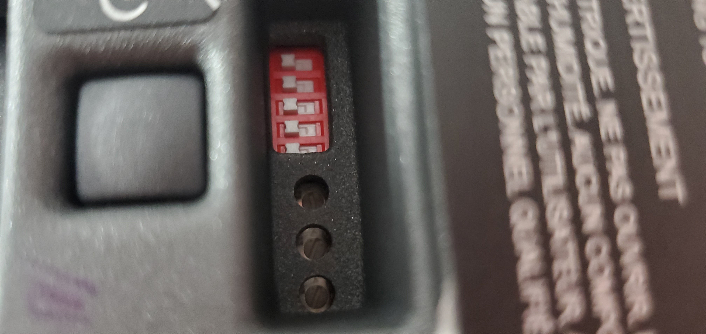
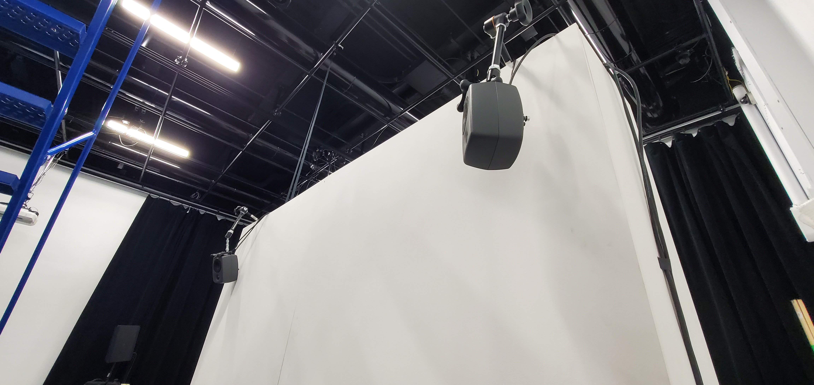
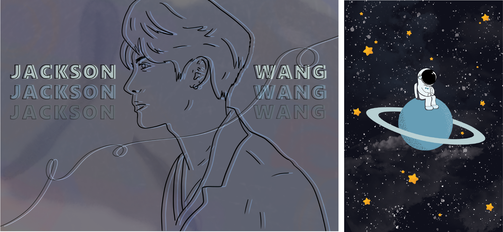

# Journal de Sabrina Kayani

* [Semaine 1](#semaine-1)
* [Semaine 2](#semaine-2)
* [Semaine 3](#semaine-3)
* [Semaine 4](#semaine-4)
* [Semaine 5](#semaine-5)
* [Semaine de rattrapage](#semaine-de-rattrapage)
* [Semaine 6](#semaine-6)
* [Semaine 7](#semaine-7)
* [Semaine 8](#semaine-8)
* [Semaine 9](#semaine-9)

## Semaine 1

### Résumé des réalisations effectuées
- J’ai modifié la préproduction avec mon équipe (changement de dialogues, ajout de risques et matériels).
- J’ai ajouté les dates des milestones sur Github.
- J’ai préparé une liste d’équipement à emprunter.
- J’ai commencé à écrire le journal de Sasha adolescente.
- J’ai récolté les photos de Sasha pour la boîte de souvenirs.
- J’ai fait les billets de concert pour la boîte de souvenirs.
- J’ai acheté des décors avec mon équipe.
- J'ai modifié les schémas de plantation.

### Image d'une réalisation dont tu es la ou le plus fier

### Est-ce que j'ai accompli l'ensemble des tâches et objectifs que je m'étais fixés pour cette semaine?	
- [x] Complètement
- [ ] Assez
- [ ] Peu
- [ ] Pas du tout

#### Décrivez pourquoi.
J’ai réussi à accomplir toutes mes tâches cette semaine grâce à mes coéquipières. En fait, nous avons eu une rencontre mercredi afin de modifier certaines parties de notre pré production tels que certains dialogues, la liste de matériels et les risques. Puisque nous avons réussi à finir toutes ces tâches en une journée, j’ai pu travailler sur d’autres tâches individuelles le jeudi. 

### Mon projet s'est-il réalisé selon l’échéancier prévu?

- [x] Complètement
- [ ] Assez
- [ ] Un peu
- [ ] Pas tout à fait

### Défis pour la prochaine semaine
Pour la semaine prochaine, je me donne comme défi d’écrire au moins 5 pages de journal intime de Sasha adolescente à l’ordinateur et de les faire approuver par mon équipe pour ensuite les transcrire dans le journal physique à la main. Mon dernier défis serait d'enregistrer l'oral de la préproduction avec mon équipe.

---
## Semaine 2
### Résumé des réalisations effectuées
- J’ai filmé la préproduction avec mon équipe.
- J'ai eu une rencontre pour le formatif de la préproduction.
- J’ai modifier les photos récoltées pour la boîte de souvenir sur photoshop.
- J’ai acheté 2 journaux.
- J’ai écrit 10 entrées de journaux pour le journal de Sasha adolescente sur Word.
- J’ai retranscrit 5 de ces entrées dans le journal physique à la main.

### Image d'une réalisation dont tu es la ou le plus fier

### Est-ce que j'ai accompli l'ensemble des tâches et objectifs que je m'étais fixés pour cette semaine?

- [x] Complètement
- [ ] Assez
- [ ] Peu
- [ ] Pas du tout

#### Décrivez pourquoi.
J’ai réussi à accomplir toutes les tâches de la semaine puisque lundi mon équipe et moi sommes allées à l’école pour travailler tous ensemble. À l’école, je me sentais plus motivé à travailler, donc j’ai pu modifier toutes les photos durant notre rencontre à l’école. Cette rencontre m’a aussi permis d’avoir l’approbation de mon équipe plus rapidement ce qui m’a permis ensuite de faire la prochaine tâche qui était d’écrire le journal. Après la rencontre du lundi, je suis allée acheter les journaux pour que durant la semaine je puisse transcrire les entrées à la main du journal adolescent.

### Mon projet s'est-il réalisé selon l’échéancier prévu?

- [x] Complètement
- [ ] Assez
- [ ] Un peu
- [ ] Pas tout à fait

### Défis pour la prochaine semaine
Pour la semaine prochaine, je me donne comme défi de faire fonctionner la kinect pour déclencher notre installation et d’écrire 5 autres entrées du journal adolescent dans le journal physique. Mon défi final est d’enregistrer notre préproduction.

---
## Semaine 3 
### Résumé des réalisations effectuées
- J’ai filmé la préproduction avec mon équipe.
- J’ai écrit 17 entrées du journal adolescent.
- J’ai écrit un scénario plus détaillé pour chaque vidéo qui sera projetée dans la chambre de Sasha.
- J’ai fait des corrections à notre préproduction suite à la rencontre avec les professeurs.
- J’ai trouvé mon lit gonflable queen!

### Image d'une réalisation dont tu es la ou le plus fier

### Est-ce que j'ai accompli l'ensemble des tâches et objectifs que je m'étais fixés pour cette semaine?

- [ ] Complètement
- [x] Assez
- [ ] Peu
- [ ] Pas du tout

#### Décrivez pourquoi.
J’ai réussi à filmer notre préproduction car mon équipe et moi avions fixé une date de rencontre pour la filmer. Nous étions toutes bien préparées, donc on a réussi à filmer la vidéoconférence rapidement. Ensuite, j’ai réussi à remplir 17 autres pages du journal adolescent de Sasha! En fait, je suis venu à l’école chaque jour avec mon équipe pour travailler le plus possible sur le projet. Celà m’a permis de bien avancer le journal. Malheureusement, je n’ai pas pu venir à l’école jeudi pour faire fonctionner la Kinect avec mon équipe dû à des circonstances hors de mon contrôle. 

#### S'il y a lieu, qu'allez-vous faire pour remédier à la situation?
Mes coéquipières ont réussi à faire fonctionner la kinect! J'apprécie beaucoup leur aide et effort!

### Mon projet s'est-il réalisé selon l’échéancier prévu?

- [x] Complètement
- [ ] Assez
- [ ] Un peu
- [ ] Pas tout à fait

### Défis pour la prochaine semaine
Je me donne comme défi de remplir 15 autres pages de journal adolescent. Mon dernier défis est de modifier une partie de notre vidéoconférence à l'aide de Davinci Resolve.

---
## Semaine 4
### Résumé des réalisations effectuées
- J'ai transcrit 15 pages du journal adolescent. 
- J'ai décoré la couverture du journal adolescent. 
- J'ai confectionné le bracelet pour la boîte de souvenirs.
- J'ai composé la musique pour accompagner la conclusion de notre projet. 
- J'ai modifié les dialogues des camarades.

### Image d'une réalisation dont tu es la ou le plus fier

### Est-ce que j'ai accompli l'ensemble des tâches et objectifs que je m'étais fixés pour cette semaine?

- [x] Complètement
- [ ] Assez
- [ ] Peu
- [ ] Pas du tout

#### Décrivez pourquoi.
J'ai réussi à transcrire les 15 pages finales du journal adolescent parce que je me suis donnée comme objectif de transcrire 5 pages par jour. Lorsque j'avais fini de transcrire ces pages, j'ai décoré la couverture du journal à l'aide des dessins que ma coéquipière Angelina et moi avons créés. Par la suite, j'ai découvert le site Web bandlab qui m'a permis de créer la musique pour la conclusion avec divers instruments disponible sur le site!

### Mon projet s'est-il réalisé selon l’échéancier prévu?

- [x] Complètement
- [ ] Assez
- [ ] Un peu
- [ ] Pas tout à fait

### Défis pour la prochaine semaine
Je me donne comme défi d'écrire 5 pages du journal adulte et de faire des dessins pour décorer la couverture du journal. Aussi, je me donne comme défi d'enregistrer la voix de deux camarades. Finalement, je me donne comme défi de tester le dimmer pack avec Trish.

---
## Semaine 5
### Résumé des réalisations effectuées
- J’ai installé des lumières
- J’ai installé des speakers
- J’ai fait l’enregistrement des voix de 4 camarades
- J’ai fait des dessins pour le journal adulte
- J'ai fait le signet pour le journal adulte
- J’ai écrit 11 entrées de journal adulte
- J’ai amené ma lampe de lave à l’école
- J'ai testé le dimmer pack avec la lampe à lave

### Image d'une réalisation dont tu es la ou le plus fier

### Est-ce que j'ai accompli l'ensemble des tâches et objectifs que je m'étais fixés pour cette semaine?

- [x] Complètement
- [ ] Assez
- [ ] Peu
- [ ] Pas du tout

#### Décrivez pourquoi.
Cette semaine, j’ai pu enfin retourner à l’école! Lundi, mon équipe m’a expliqué en détail ce que j’ai manqué. Ça m’a permis de comprendre tout ce qu’on devait réaliser durant la semaine. Donc, j’ai ainsi commencé à installer nos lumières et hauts parleurs à l’aide de mes coéquipières. Par la suite, entre-temps, j’écrivais le journal et je faisais les dessins sur mon portable une fois arrivé chez moi. Finalement, pour les enregistrements, on avait toute préparé une journée avant les enregistrements des doubleurs pour s’assurer que tout le micro et l'enregistrement fonctionnaient bien.

### Mon projet s'est-il réalisé selon l’échéancier prévu?

- [x] Complètement
- [ ] Assez
- [ ] Un peu
- [ ] Pas tout à fait

### Défis pour la prochaine semaine
Mon premier défi serait d’amener le lit gonflable, la table à chevet, un fauteuil poire, une poubelle, des vêtements et les couvertures de lit au studio pour ensuite commencer l’installation de la chambre. Ensuite, mon deuxième défi serait d’enregistrer les restant des voix. Mon dernier défi serait de retranscrire les entrées de journal adulte dans le journal physique et continuer à faire des dessins pour le journal.

---
## Semaine de rattrapage
### Résumé des réalisations effectuées
- J’ai amené le lit, la table à chevet, la poubelle, le fauteuil poire et les couvertures de lit.
- J’ai fait le setup du sound device et j’ai testé si l’enregistrement était fonctionnel.
- J’ai fait l’enregistrement des voix du père, de Sasha et du dernier camarade.
- J’ai ajusté le gain des 4 haut-parleurs pour diminuer le noise.
- J’ai écrit 5 entrées de journal adulte.

### Image d'une réalisation dont tu es la ou le plus fier

### Est-ce que j'ai accompli l'ensemble des tâches et objectifs que je m'étais fixés pour cette semaine?

- [x] Complètement
- [ ] Assez
- [ ] Peu
- [ ] Pas du tout

#### Décrivez pourquoi.
Cette semaine, j’ai pu ajuster le gain des 4 haut-parleurs parce qu’on les avait déjà installés la semaine précédente. Donc, je m’assurais qu’il n’ait pas de noise qui sorte des haut-parleurs. Ensuite, j’ai pu amener les décors à l’école parce que mon équipe et moi, avions décidé de venir tous porter le samedi au studio. Finalement, les enregistrements des doubleurs a pu être fait parce qu’on avait déjà fait le casting pour ces rôles.

### Mon projet s'est-il réalisé selon l’échéancier prévu?

- [x] Complètement
- [ ] Assez
- [ ] Un peu
- [ ] Pas tout à fait

### Défis pour la prochaine semaine
Mon premier défi serait d’installer la chambre en plaçant les décors au bon endroit avec mon équipe. Mon deuxième défi serait d’enregistrer les vidéos qui seront projetées sur le mur. Mon deuxième défi serait de compléter le journal adulte et d’amener les 2 journaux à l’école. Mon dernier défi serait de faire des dessins pour accompagner les affiches.

---
## Semaine 6
### Résumé des réalisations effectuées
- J’ai installé les décorations pour la chambre adolescente et adulte.
- J’ai filmé les scènes à projeter.
- J’ai conçu deux posters.
- J’ai acheté des décorations de plus.
- J’ai fini de transcrire le journal adulte.
- J’ai fait le montage de la voix du père avec un effet de téléphone.
- J’ai fait des dessins pour le journal adulte et je l’ai décoré.

### Image d'une réalisation dont tu es la ou le plus fier

### Est-ce que j'ai accompli l'ensemble des tâches et objectifs que je m'étais fixés pour cette semaine?

- [x] Complètement
- [ ] Assez
- [ ] Peu
- [ ] Pas du tout

#### Décrivez pourquoi.
Cette semaine, j’ai pu filmer les scènes à projeter parce que mon équipe et moi sommes venus à l’école pour le tournage. En fait, on avait tout installé les décorations des chambres avant de filmer. Ensuite, après avoir filmer, j’ai pu me concentrer à concevoir mes deux posters pour les avoir terminés pour mercredi afin que Guillaume, notre enseignant, puisse les imprimer. Par la suite, j’ai pu finir de transcrire toute le journal adulte à la main et le décorer quand j’avais terminé les posters. Finalement, à l'école, j'ai fait le montage sonore du père de Sasha. J’ai ajouté un effet d’appel téléphonique sur la voix. 

### Mon projet s'est-il réalisé selon l’échéancier prévu?

- [x] Complètement
- [ ] Assez
- [ ] Un peu
- [ ] Pas tout à fait

### Défis pour la prochaine semaine
Mes défis sont de déplacer l’ordinateur dans la salle des matrices avec mon équipe. Mon dernier défi serait de tester l’installation afin de trouver des bogues et les réparer avec mon équipe.

---
## Semaine 7
### Résumé des réalisations effectuées

### Image d'une réalisation dont tu es la ou le plus fier

### Est-ce que j'ai accompli l'ensemble des tâches et objectifs que je m'étais fixés pour cette semaine?

- [ ] Complètement
- [ ] Assez
- [ ] Peu
- [ ] Pas du tout

#### Décrivez pourquoi.
 

#### S'il y a lieu, qu'allez-vous faire pour remédier à la situation?

### Mon projet s'est-il réalisé selon l’échéancier prévu?

- [ ] Complètement
- [ ] Assez
- [ ] Un peu
- [ ] Pas tout à fait

#### S'il y a des écarts, décrivez-les.

#### S'il y a lieu, qu'allez-vous faire pour remédier à la situation?

### Défis pour la prochaine semaine

## Semaine 8

## Semaine 9
