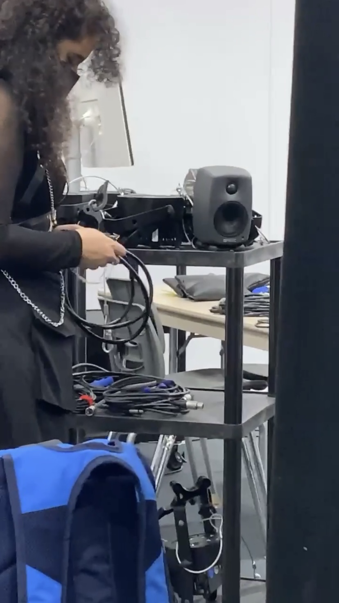
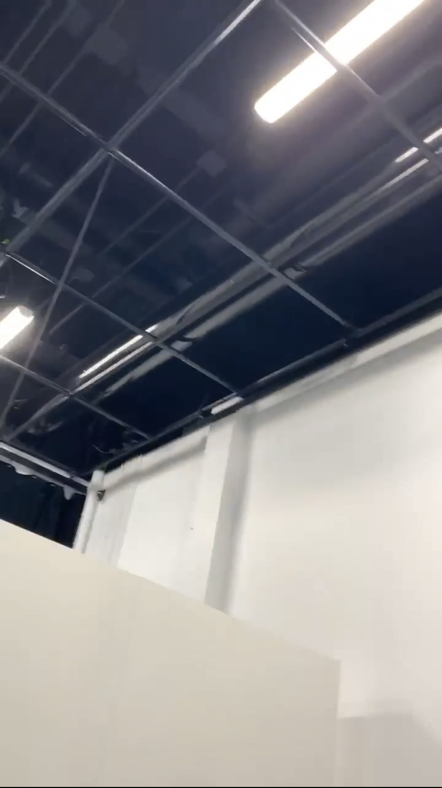
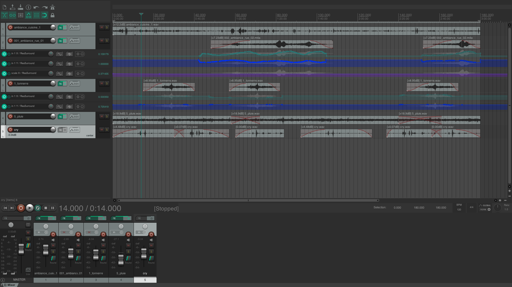
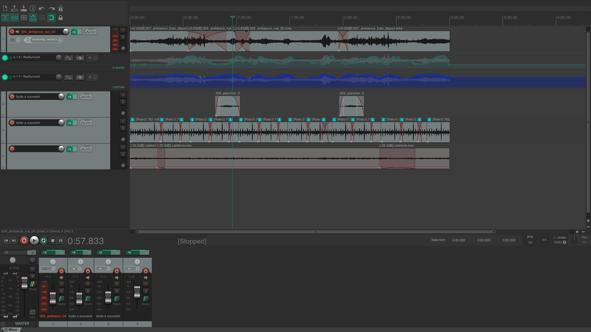
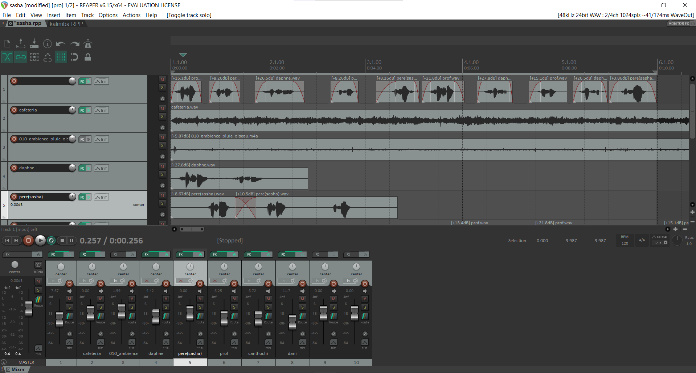
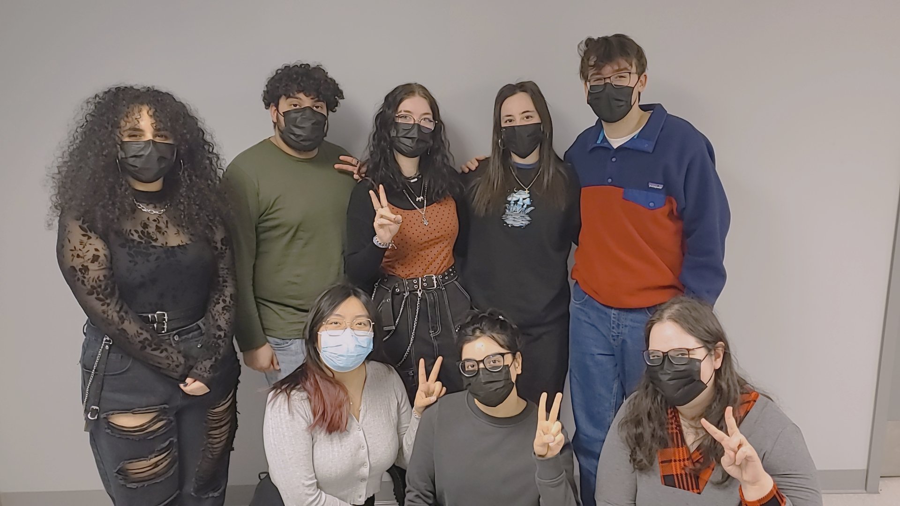

# Journal de Trish Nguyen

* [Semaine 1](#semaine-1)
* [Semaine 2](#semaine-2)
* [Semaine 3](#semaine-3)
* [Semaine 4](#semaine-4)
* [Semaine 5](#semaine-5)
* [Semaine de rattrapage](#semaine-de-rattrapage)
* [Semaine 6](#semaine-6)
* [Semaine 7](#semaine-7)
* [Semaine 8](#semaine-8)
* [Semaine 9](#semaine-9)

## Semaine 1

### Résumé des réalisations effectuées
- Ajouter les dossiers manquants dans le github
- Changer le participant #1 et journal #1 en incluant mon nom.
- Modifier le dialogue dans le scénario
- Déterminer les rôles (coordination technique, artistique, communication, générale)
- Écrire l'appel de casting pour les voix et le personnage principal (Sasha)
- Ajouter les contraintes techniques et potentiels problèmes de production soulever dans le cours contrôle qualité
- Faire et documenter l'inventaire
- Déterminer qui apporte quoi dans la liste de matériel
- Enregistrement pour la banque sonnore

### Image d'une réalisation dont tu es la ou le plus fier

### Est-ce que j'ai accompli l'ensemble des tâches et objectifs que je m'étais fixés pour cette semaine?	
- [ ] Complètement
- [x] Assez
- [ ] Peu
- [ ] Pas du tout

#### Décrivez pourquoi.
 J'ai mis assez, car je n'ai pas fini les enregistements pour la banque sonore. 

#### S'il y a lieu, qu'allez-vous faire pour remédier à la situation?
Je planifiais déjà de le complèter en fin de semaine.

### Mon projet s'est-il réalisé selon l’échéancier prévu?

- [x] Complètement
- [ ] Assez
- [ ] Un peu
- [ ] Pas tout à fait

#### S'il y a des écarts, décrivez-les.
(x)

#### S'il y a lieu, qu'allez-vous faire pour remédier à la situation?
(x)

### Défis pour la prochaine semaine
Je dois monté l'ambiance sonore pour la semaine 2.

---
## Semaine 2
### Résumé des réalisations effectuées
- Modification de la préproduction avec mon équipe
- Réaliser le bannière et l'image de couverture du site Web
- Enregister les sons pour la bande sonore du côté ado
- Montage de la bande sonore (ado) avec Reaper 

### Image d'une réalisation dont tu es la ou le plus fier

### Est-ce que j'ai accompli l'ensemble des tâches et objectifs que je m'étais fixés pour cette semaine?

- [ ] Complètement
- [X] Assez
- [ ] Peu
- [ ] Pas du tout

#### Décrivez pourquoi.
 J'ai choisi assez, car je me suis donnée un objectif trop ambitieuse. Je n'ai pas réalisé l'ampleur de la tâche. Spécifiquement le montage sonore, car je devais enregister tous les sons premièrement.
#### S'il y a lieu, qu'allez-vous faire pour remédier à la situation?
Je vais simplement prendre le temps necessaire pour le faire. Mes coéquipières sont d'accord que je me suis trop donnée de tâches.

### Mon projet s'est-il réalisé selon l’échéancier prévu?

- [X] Complètement
- [ ] Assez
- [ ] Un peu
- [ ] Pas tout à fait

#### S'il y a des écarts, décrivez-les.
J'ai atteint mon objectif, car moi et mon équipe, nous sommes venues au grand studio tous les jours pour travailler sur nos tâches.

#### S'il y a lieu, qu'allez-vous faire pour remédier à la situation?
(x)

### Défis pour la prochaine semaine
- Continuer à récolter les sons pour le montage
- Faire fonctionner la kinnect avec Max
- Filmer la conférence de la préproduction
- Imprimer les photos pour la boîte de souvenir
---
## Semaine 3 
### Résumé des réalisations effectuées
- Fini le montage de l'ambiance sonore du côté adolescent
- Grandement avancé le montage de l'ambiance sonore du côté adulte
- Participé au fonctionnement de la kinnect (majoritairement faite par Karine)
- Filmée la conférence de la préproduction
- Imprimés les photos de la boîte de souvenir
- Démontés les spots, les lumières RGB, les speakers et les fils qui étaient au plafond du grand studio
- Placé les faux murs avec l'aide de Xavier (TTP)
- Testé les dimensions du projecteur par raport au faux murs
- Emprunté la liste de matériel
- Écrit la description du thème *temps* et choisie une image poétique
### Image d'une réalisation dont tu es la ou le plus fier
Voici le chariot avec tout le matériel j'ai démonté :D

Voici le plafond maintenant tout propre, prêt pour installer à nouveau!

### Est-ce que j'ai accompli l'ensemble des tâches et objectifs que je m'étais fixés pour cette semaine?

- [X] Complètement
- [ ] Assez
- [ ] Peu
- [ ] Pas du tout

#### Décrivez pourquoi.
J'ai atteint mon objectif, car moi et mon équipe, nous sommes venues au grand studio tous les jours pour travailler sur nos tâches et démonter le materiel. De plus, puisqu'on arrive tôt les matins à chaque jour, j'ai pu utiliser l'echelle autant que je voulais puisque les autres élèves n'étaient pas là. 

#### S'il y a lieu, qu'allez-vous faire pour remédier à la situation?
(x)

### Mon projet s'est-il réalisé selon l’échéancier prévu?

- [x] Complètement
- [ ] Assez
- [ ] Un peu
- [ ] Pas tout à fait

#### S'il y a des écarts, décrivez-les.
(x)

#### S'il y a lieu, qu'allez-vous faire pour remédier à la situation?
(x)

### Défis pour la prochaine semaine
- Finir le montage de l'ambiance sonore côté adulte
- Acheter la boîte de souvenir 
- Déplacer la kinnect 
- Installer le projecteur et possiblement les hauts-parleurs
---
## Semaine 4
### Résumé des réalisations effectuées
- déplacée la kinnect
- achetée la boîte à souvenir
- fini l'ambiance sonore côté adulte
- validées les ambinaces sonores
- Installée le projecteur
- rencontrée pour les canditats du casting
- fait la bannière Moebius
- soudée la magnétic latch
- déplacée les faux murs
- correction au dialogues des personnages

### Image d'une réalisation dont tu es la ou le plus fier

### Est-ce que j'ai accompli l'ensemble des tâches et objectifs que je m'étais fixés pour cette semaine?

- [x] Complètement
- [ ] Assez
- [ ] Peu
- [ ] Pas du tout

#### Décrivez pourquoi.
 J'ai atteint mon objectif, car moi et mon équipe, nous sommes venues au grand studio tous les jours pour travailler sur nos tâches. De plus, moi et mon équipe nous avons planifé des rencontres avec les candidat de casting.

#### S'il y a lieu, qu'allez-vous faire pour remédier à la situation?
(x)

### Mon projet s'est-il réalisé selon l’échéancier prévu?

- [x] Complètement
- [ ] Assez
- [ ] Un peu
- [ ] Pas tout à fait

#### S'il y a des écarts, décrivez-les.
(x)

#### S'il y a lieu, qu'allez-vous faire pour remédier à la situation?
(X)

### Défis pour la prochaine semaine
- apporter le decors  au studio
- produire des sons de notification et de sonnerie pour le téléphone
- commencer la spatialisation sonore
- faire le dimmer pack avec Sabrina (contente de te revoir!)
---
## Semaine 5
### Résumé des réalisations effectuées
- produit le sons de notification et les deux sonnerie pour le téléphone
- Fait un test de spatialisation sonore dans les hauts-parleurs
- Fini la spatialisation de l'ambiance ado et adulte
- brancher les hauts-parleurs au carte de son
- fait le dimmer pack
- enregistrement du casting
### Image d'une réalisation dont tu es la ou le plus fier
patch Reaper pour le côté adolescent

patch Reaper pour le côté adulte

### Est-ce que j'ai accompli l'ensemble des tâches et objectifs que je m'étais fixés pour cette semaine?

- [X] Complètement
- [ ] Assez
- [ ] Peu
- [ ] Pas du tout

#### Décrivez pourquoi.
 J'ai atteint mon objectif, car moi et mon équipe, nous sommes venues au grand studio tous les jours pour travailler sur nos tâches. J'ai aussi eu de l'aide de la part de Daryl et de Guillaume pour la spatialisation sonore.

#### S'il y a lieu, qu'allez-vous faire pour remédier à la situation?
(x)

### Mon projet s'est-il réalisé selon l’échéancier prévu?

- [x] Complètement
- [ ] Assez
- [ ] Un peu
- [ ] Pas tout à fait

#### S'il y a des écarts, décrivez-les.
(x)

#### S'il y a lieu, qu'allez-vous faire pour remédier à la situation?
(X)

### Défis pour la prochaine semaine
- amener le décors
- changer le branchement des hauts-parleurs
- finir d'enregistrer les voix (Sasha, père et professeur)
- finir le montage des doubleurs (camarades, professeur, sasha et père)
- corriger le banner Moebius
---
## Semaine de rattrapage
### Résumé des réalisations effectuées
- amené les lampes et la table
- Fini les branchements des hauts-parleurs
- fini l'enregistrement des voix 
- commencé le montage des doubleurs
- corrigé la spatialisation sonore
- corrigé le banner Moebius
- dessiner le croquis de l'affiche

### Image d'une réalisation dont tu es la ou le plus fier

### Est-ce que j'ai accompli l'ensemble des tâches et objectifs que je m'étais fixés pour cette semaine?

- [ ] Complètement
- [X] Assez
- [ ] Peu
- [ ] Pas du tout

#### Décrivez pourquoi.
 Je n'ai pas fini le montage sonore.

#### S'il y a lieu, qu'allez-vous faire pour remédier à la situation?
J'ai décidé de prioriser l'affiche plutôt que l'e montage sonore, car guillaume doit l'imprimer avant qu'il part pour paris.

### Mon projet s'est-il réalisé selon l’échéancier prévu?

- [X] Complètement
- [ ] Assez
- [ ] Un peu
- [ ] Pas tout à fait

#### S'il y a des écarts, décrivez-les.
(x)

#### S'il y a lieu, qu'allez-vous faire pour remédier à la situation?
(x)

### Défis pour la prochaine semaine
- finir l'affiche
- finir le montage sonore de la voix Sasha + Père
- commence le montage sonore des camarades + professeur
- acheter ou amener du décors
---
## Semaine 6
### Résumé des réalisations effectuées
- fini l'affiche
- fini le montage sonore de la voix Sasha, de l'intro et des camarades + professeur
- acheter des ampoules avec karine
- décorer la chambre

### Image d'une réalisation dont tu es la ou le plus fier

### Est-ce que j'ai accompli l'ensemble des tâches et objectifs que je m'étais fixés pour cette semaine?

- [x] Complètement
- [ ] Assez
- [ ] Peu
- [ ] Pas du tout

#### Décrivez pourquoi.
J'ai atteint mon objectif, car moi et mon équipe, nous sommes venues au grand studio tous les jours pour travailler sur nos tâches. J'ai aussi eu de l'aide de la part de Sabrina, car elle a fait le montage sonore du père. J'ai donc pu finir tous mes assets sonores cette semaine.

#### S'il y a lieu, qu'allez-vous faire pour remédier à la situation?
(x)

### Mon projet s'est-il réalisé selon l’échéancier prévu?

- [X] Complètement
- [ ] Assez
- [ ] Un peu
- [ ] Pas tout à fait

#### S'il y a des écarts, décrivez-les.
(x)

#### S'il y a lieu, qu'allez-vous faire pour remédier à la situation?
(x)

### Défis pour la prochaine semaine
- Tester les audios et la spatialisation
- Ajouter des dessins au mur
- corriger les erreurs de français dans mon journal
- déplacer l'ordinateur à la salle des matrices
---
## Semaine 7
### Résumé des réalisations effectuées

### Image d'une réalisation dont tu es la ou le plus fier

### Est-ce que j'ai accompli l'ensemble des tâches et objectifs que je m'étais fixés pour cette semaine?

- [ ] Complètement
- [ ] Assez
- [ ] Peu
- [ ] Pas du tout

#### Décrivez pourquoi.
 

#### S'il y a lieu, qu'allez-vous faire pour remédier à la situation?

### Mon projet s'est-il réalisé selon l’échéancier prévu?

- [ ] Complètement
- [ ] Assez
- [ ] Un peu
- [ ] Pas tout à fait

#### S'il y a des écarts, décrivez-les.

#### S'il y a lieu, qu'allez-vous faire pour remédier à la situation?

### Défis pour la prochaine semaine

## Semaine 8

## Semaine 9