# Préproduction
> C'est ici qu'on dépose les éléments de la préproduction.

# Table des matières
1. [Intention ou concept](#Intention-ou-concept)
    - [Cartographie](#Cartographie)
    - [Intention de départ](#Intention-de-départ)
    - [Synopsis](#Synopsis)
    - [Tableau d'ambiance (*moodboard*)](#Tableau-d'ambiance-(*moodboard*))
    - [Scénario, scénarimage ou document audio/visuel](#Scénario,-scénarimage-ou-document-audio/visuel)
2. [Planification technique d'un prototype (devis technique)](#Planification-technique-d'un-prototype-(devis-technique))
    - [Schémas ou plans techniques](#Schémas-ou-plans-techniques)
    - [Matériaux requis](#Matériel-de-scénographie-requis)
    - [Équipements requis](#Équipements-requis)
    - [Logiciels requis](#Logiciels-requis)
    - [Ressources humaines requises](#Ressources-humaines-requises)
    - [Ressources spatiales requises (rangement et locaux)](#Ressources-spatiales-requises-(rangement-et-locaux))
    - [Contraintes techniques et potentiels problèmes de production](#Contraintes-techniques-et-potentiels-problèmes-de-production)
3. [Planification de la production d'un prototype (budget et étapes de réalisation)](#Planification-de-la-production-d'un-prototype-(budget-et-étapes-de-réalisation))
    - [Budget prévisionnel](#Budget-prévisionnel)
    - [Échéancier global](#Échéancier-global)
    - [Liste des tâches à réaliser](#Liste-des-tâches-à-réaliser)
    - [Rôles et responsabilités des membres de l'équipe](#Rôles-et-responsabilités-des-membres-de-l'équipe))
    - [Moments des rencontres d'équipe](#Moments-des-rencontres-d'équipe)

# Intention ou concept
## Cartographie

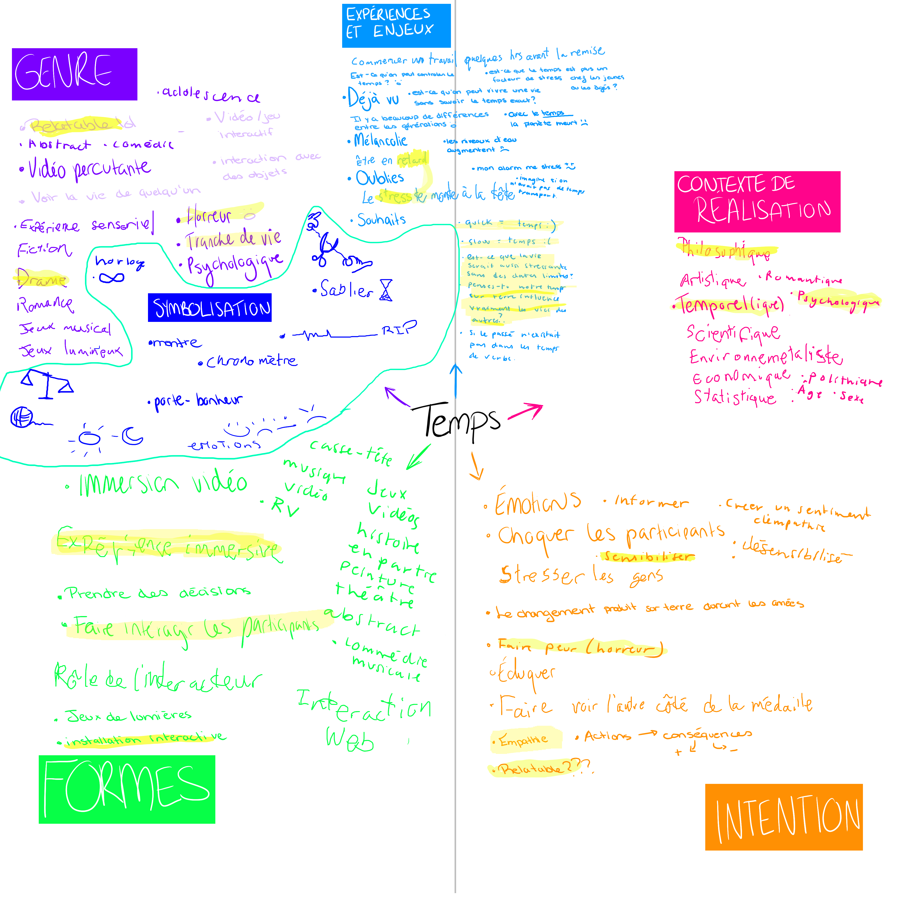
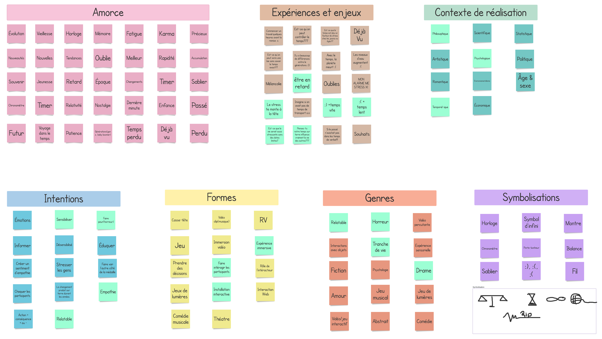

## Intention de départ
Par ce projet, nous souhaitons exposer comment la vie d'une personne LGBTQ+ entourée de parents qui ne supporte pas leur enfant peut changer au fil du temps. Aussi, on veux exposer comment un conflit intergénérationnel peut influencer la vie d'une personne de façon négative, mais celle-ci peut finir par s'en sortir.

## Synopsis
Sasha adolescente et Sasha adulte vivent leur vie. Durant son adolescence, Sasha se fait négliger par ses parents et cela affecte sa santé mentale. Pendant sa vie d'adulte, Sasha habite maintenant seule, Sasha s'accepte, mais ses parents sont toujours contre elle. Cependant, Sasha se porte mieux mentalement qu'avant. 

Le public est appelé à découvrir que les deux vies projetées devant eux sont différents passages de la vie d'une seule et même personne.

## Tableau d'ambiance (*moodboard*)
> Moodboard chambre adolescent
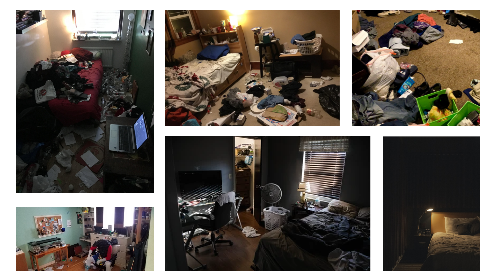
Lit adolescent
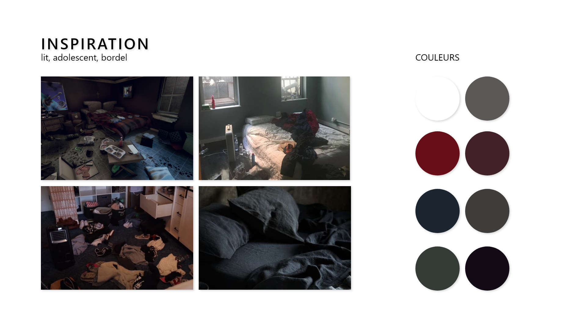
Journal adolescent
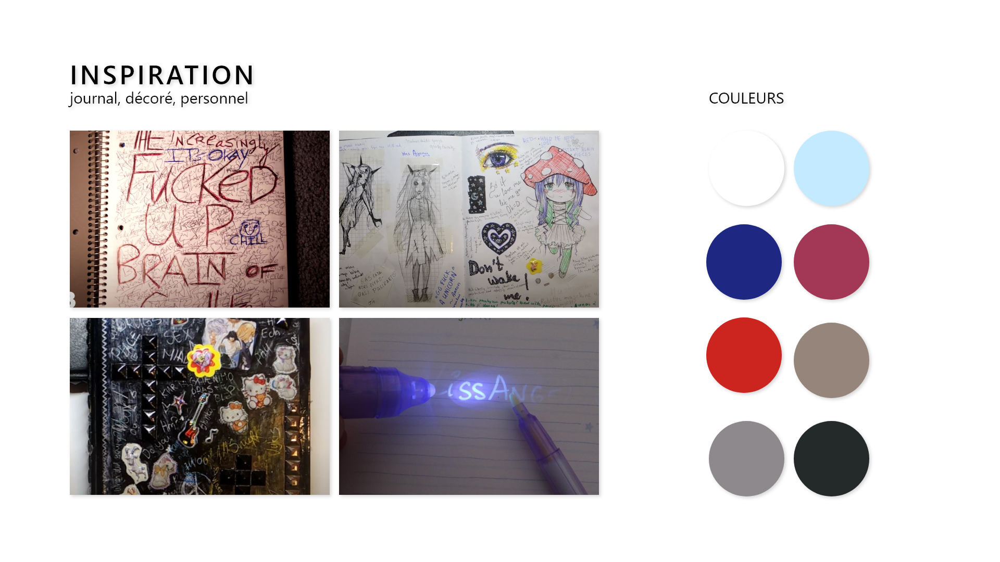
Poubelle adolescent
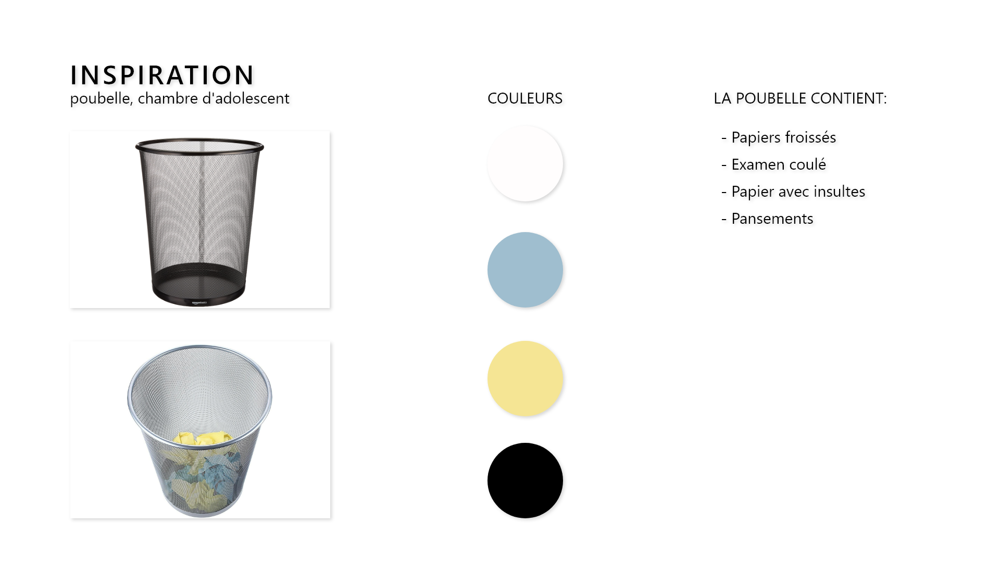
Ambiance sonore adolescent
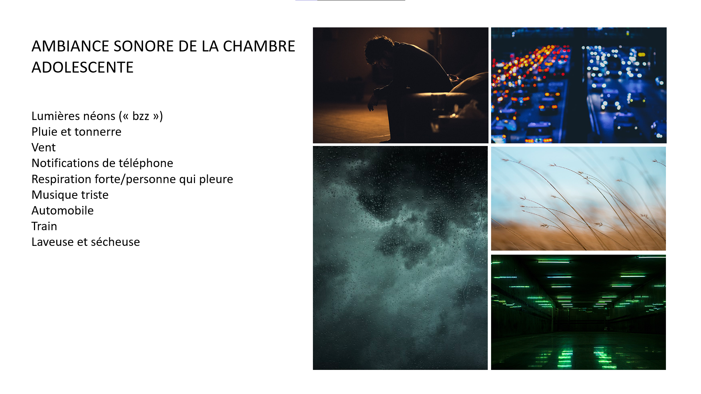

* Lumières néons (« bzz ») 
https://sound-effects.bbcrewind.co.uk/search?q=07014122
https://sound-effects.bbcrewind.co.uk/search?q=07069067

* Pluie et tonnerre: 
https://sound-effects.bbcrewind.co.uk/search?q=NHU05032134
https://sound-effects.bbcrewind.co.uk/search?q=NHU05044027

* Vent:
https://sound-effects.bbcrewind.co.uk/search?q=NHU05044027

* Notifications de téléphone:
https://sound-effects.bbcrewind.co.uk/search?q=07042244

* Respiration forte/personne qui pleure:
https://sound-effects.bbcrewind.co.uk/search?q=07071016
https://sound-effects.bbcrewind.co.uk/search?q=07034123

* musique triste:
https://youtu.be/WGURnJV01J0

* Automobile: 
https://sound-effects.bbcrewind.co.uk/search?q=0009017

* Train:
https://sound-effects.bbcrewind.co.uk/search?q=07006092

* son dans la maison:
https://sound-effects.bbcrewind.co.uk/search?q=07027238 (mircro ondes)

*Laveuse et sécheuse:
https://sound-effects.bbcrewind.co.uk/search?q=07027234
https://sound-effects.bbcrewind.co.uk/search?q=07040177

> Moodboard chambre adulte

Lit adulte

Journal adulte
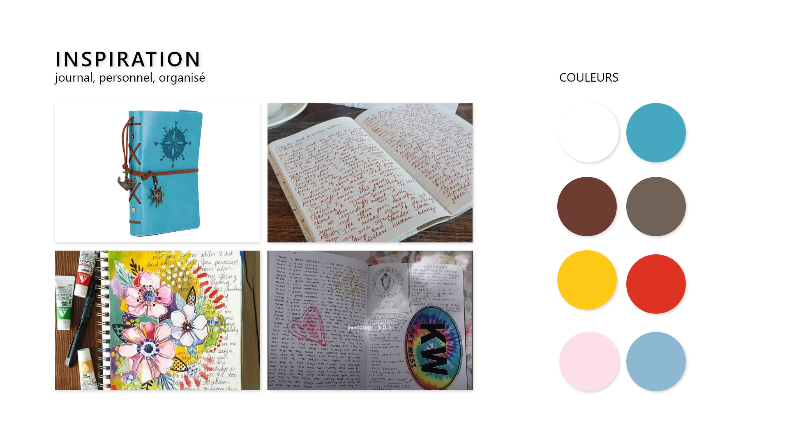
Boite de souvenir adulte
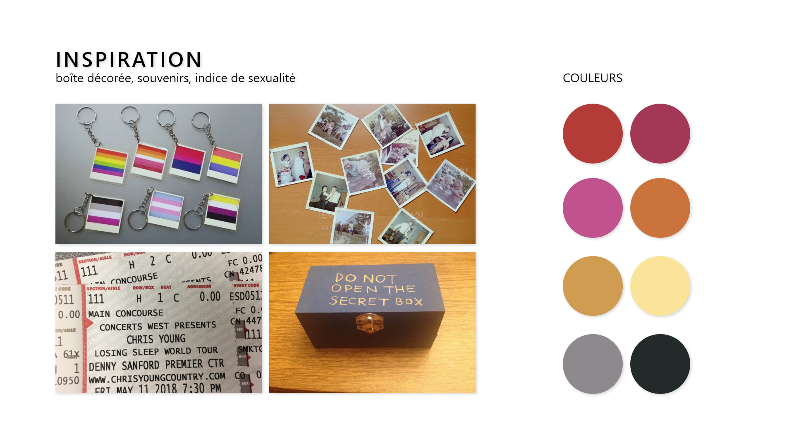
Plante adulte
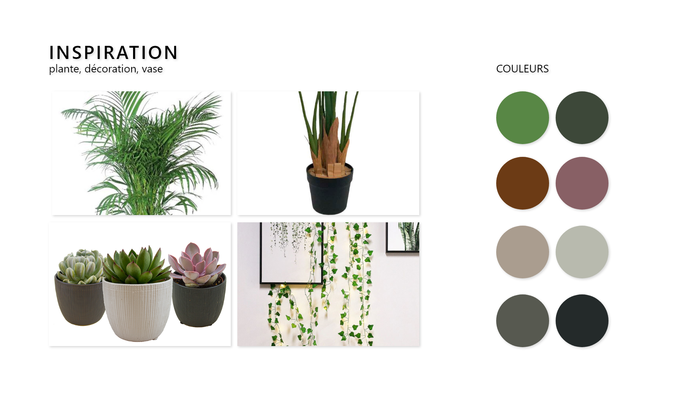
Ambiance sonore adulte
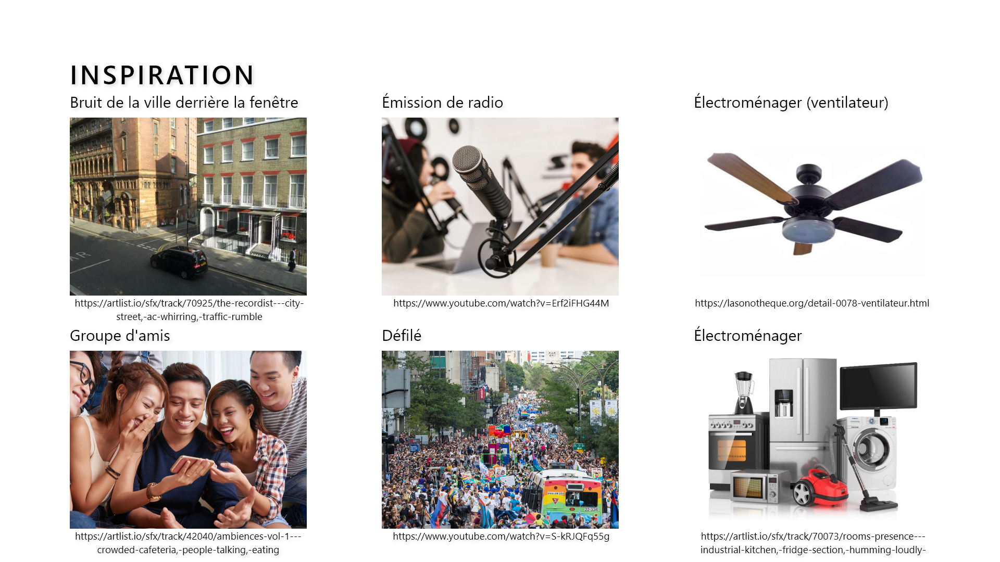
* Ville: https://artlist.io/sfx/track/70925/the-recordist---city-street,-ac-whirring,-traffic-rumble
* Radio: https://www.youtube.com/watch?v=Erf2iFHG44M
* Ventilateur: https://lasonotheque.org/detail-0078-ventilateur.html
* Amis: https://artlist.io/sfx/track/42040/ambiences-vol-1---crowded-cafeteria,-people-talking,-eating
* Défilé: https://www.youtube.com/watch?v=S-kRJQFq55g
* Électroménager: https://artlist.io/sfx/track/70073/rooms-presence---industrial-kitchen,-fridge-section,-humming-loudly-

## Scénario, scénarimage ou document audio/visuel

**SCÈNE INTRODUCTION**

Les deux sections de la chambre sont allumées ainsi que les lumières par-dessus les 6 objets sont allumées. Des mots sont projetés sur le mur derrière le lit. Le public entre dans la chambre. Un lit est au milieu de la pièce: celui- ci est séparé en deux sections et une table de chevet se retrouve de chaque côté. La section gauche représente la chambre de Sacha adolescente (16 ans) et la section droite représente la chambre adulte de Sasha (24 ans). Après quelque temps, toutes les lumières s'éteignent.

**SCÈNE 01 ADOLESCENTE**

La section adolescente de la chambre s’illumine. Le public est amené à observer les deux sections pendant une minute. Après, le téléphone fait un son de notification et s’illumine. Cet événement amène le public à se rapprocher de la table de chevet de la section gauche (côté adolescent) et interagir avec l’appareil. 

Sur l’appareil, on voit apparaître des notifications de messages textes en temps réel. Après quelque temps, le téléphone reçoit un appel téléphonique du père de Sasha et le public a le choix de soit répondre au téléphone ou ignorer l’appel:

S'il répond: le père de Sasha la réprimande avec un ton agressif sur sa sexualité.

PÈRE: Qu'est-ce qui t'as pris autant de temps? soupir allo?  silence allo? SASHA! allo!? Eille, parle moi! ...t'es tu sourdes?!
Répond moi calisse. soupir La, la quand je rentre on va parler de toi et tes prob-

L'appel se termine, on entend la ligne qui se coupe.

S’il ignore: le téléphone arrête de sonner après 30 secondes et la boîte vocale est activée où on peut entendre le père de Sasha se plaindre qu’elle ne répond jamais au téléphone et la réprimande avec un ton agressif sur sa sexualité.

PÈRE : Allo? Allo?! Sasha?! soupir la,la prochaine fois que j'appelle tu me répond... soupir juste...juste 
rappelle moi immédiatement!

Le message vocal se termine, on entend la ligne qui se coupe.

**SCÈNE 02 ADOLESCENTE**

Soudainement, la poubelle dans la chambre de Sasha se fait renverser.
Le public est invité à observer les ordures (pansements, devoirs froissés, examen coulé, messages haineux sur papiers froissés) se trouvant sur le plancher. Après quelques secondes, une vidéo est déclenchée et projetée sur le mur de la pièce. 

Dans la vidéo, on voit la perspective de Sasha qui entre dans sa chambre et commence à mettre les ordures dans la poubelle. À ce moment, on peut entendre les insultes et réprimandes de ses camarades de classe et les inquiétudes de son professeur.

CAMARADE 1 : Eille c'est tu elle?

Les camarades commencent à rire et des chuchotements incompréhensibles peuvent être entendus.

CAMARADE 2 : Ah peux-tu sortir des toilettes, je ne suis pas confortable.

CAMARADE 3 : Oh comme c'est dommage, tu es tellement belle.

CAMARADE 4 : Ark je pensais qu'elle avait un œil sur moi.

PROFESSEUR : ..J'ai remarqué que tes notes on descendues.

**SCÈNE 03 ADOLESCENTE**

Lorsque la vidéo termine, la lampe sur la table à chevet s’allume et illumine le journal intime de Sasha. Le public est invité à lire le journal. Pendant que le public lit le journal, on entend la voix de Sasha qui fait la lecture de son journal.

SASHA ADO : Chère Sasha, aujourd'hui les élèves de ma classe ont découvert la vérité, même le professeur le sait. Quand j'ai reçu mon examen (que j'ai coulé XD), il m'a demandé si j'avais besoin d'aide. C'est gentil de sa part, mais je n’ose pas aller le voir, ce n’est pas comme s'il peut empêcher toute la classe de se moquer de moi. Ils ont lancé mon sac à dos dans les toilettes. Heureusement mon lunch a été épargné. Mes parents étaient trop occupés pour remarquer quoi que ce soit. Personne n’est de mon bord, si seulement j'étais normale.

**SCÈNE 04 ADULTE**

Le côté adolescent s’éteint et la lumière du côté adulte illumine le côté droit de la pièce. Une boîte de souvenirs est située sur la table de chevet. Du son commence à sortir de celle-ci pour amener le public à ouvrir la boîte. Après son ouverture, le son est arrêté et, quelques secondes après, une vidéo est déclenchée sur le mur de la pièce. Dans la vidéo, on voit la perspective de Sasha qui met les souvenirs dans la boîte et commence à décorer sa chambre et elle dépose un journal sur son lit.

**SCÈNE 05 ADULTE**

Le public est invité à lire le journal. Pendant que le public lit le journal, on entend la voix de Sasha qui fait la lecture de son journal.

SASHA ADULTE : Chère Sasha, demain j'ai un deuxième rendez-vous avec la fille que j'ai rencontré en ligne. Je n’ai pas encore choisi mon habit, mais j'ai hâte de la voir. Aujourd'hui, c'est le cinquième anniversaire de mon déménagement, c'est bien d'être libre. La jeune Sasha serait fière de moi.

**SCÈNE 06 ADULTE**

Le téléphone reçoit un appel téléphonique du père de Sasha et le public a le choix de soit répondre au téléphone ou ignorer l’appel:

S'il répond: le père de Sasha lui parle avec un ton passif agressif.

PÈRE : Ah tu te souviens comment décrocher le téléphone. C'est bientôt la fête de ta mère ça serait bien que pour une fois tu passes la voir. On peut mettre nos différences de côté pendant une journée. Tu devrais te forcer pour nous pardonner, on t'a tout donné. 

S’il ignore: Le téléphone arrête de sonner après 30 secondes et la boîte vocale est activée où on peut entendre le père de Sasha se plaindre qu’elle ne répond jamais au téléphone et lui demande de venir lui rendre visite de temps en temps et de ne pas le blâmer pour ses convictions.

PÈRE : Ah t'as pas appris comment décrocher le téléphone. Ça serait bien que tu viennes nous visiter de temps en temps. Tu sais c'est pas de notre faute, tu ne devrais pas nous blâmer pour nos convictions. Quand tu auras fini cette phase, tu vas nous comprendre. Viens bientôt nous rendre visite.

**SCÈNE CONCLUSION**

Toutes les lumières s'éteignent et une projection commence. On y voit une interface de message cellulaire. Sasha adolescent commence à parler et Sasha adulte lui répond.

Pour chaque dialogue, un nouveau message va apparaitre à l'écran.

SASHA ADO : Salut, comment ça va?

SASHA ADULTE : Ça va mieux.

SASHA ADO : Habites-tu encore avec nos parents?

SASHA ADULTE : Non, j'ai enfin déménagé.

SASHA ADO : Es-tu heureuse?

SASHA ADULTE : Y'a des journées qui sont plus difficiles, mais on va y arriver.

SASHA ADO : Comment tu te sens?

SASHA ADULTE : Je me sens mieux! Ça ma pris du temps à m'accepter, mais je suis fière de qui je suis.

SASHA ADO : Est-ce que maman et papa ont fini par nous accepter?

SASHA ADULTE : Pas vraiment, mais ne prends pas leurs remarques à coeur. Qu'est qui en sais. Son pas à ta place. On n’a jamais valorisé les mêmes choses, tu ne peux pas changer quelqu'un qui refuse de changer. Je sais que personne ne te la jamais dit, mais moi je suis fier de toi.

Le projecteur s'éteint lentement après la dernière phrase. Un autre projecteur s'allume au-dessus d'un ordinateur et le public est invité à envoyer des mots d'encouragement à Sasha. Sur le mur, la phrase "Envoyer un message d'encouragement à Sasha" est projeté.

**SCÉNARIMAGE**

**TIMELINE MAX**
## Brouillon
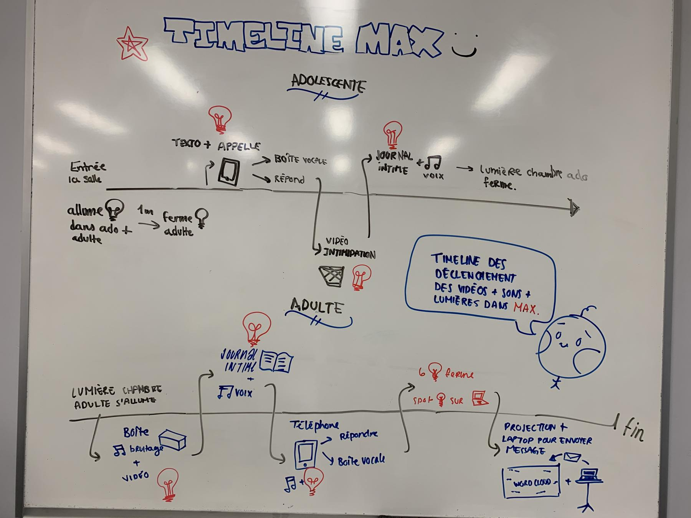
# Contenu multimédia à intégrer 
## Inventaire du contenu multimédia (excel)
* Inventaire: https://docs.google.com/spreadsheets/d/1NtG9usH4-YaT48lV3liBqm8xHrePiPiLyh4MJWYzC98/edit?usp=sharing
# Planification technique d'un prototype (devis technique)
## Schémas ou plans techniques

### Plantation 

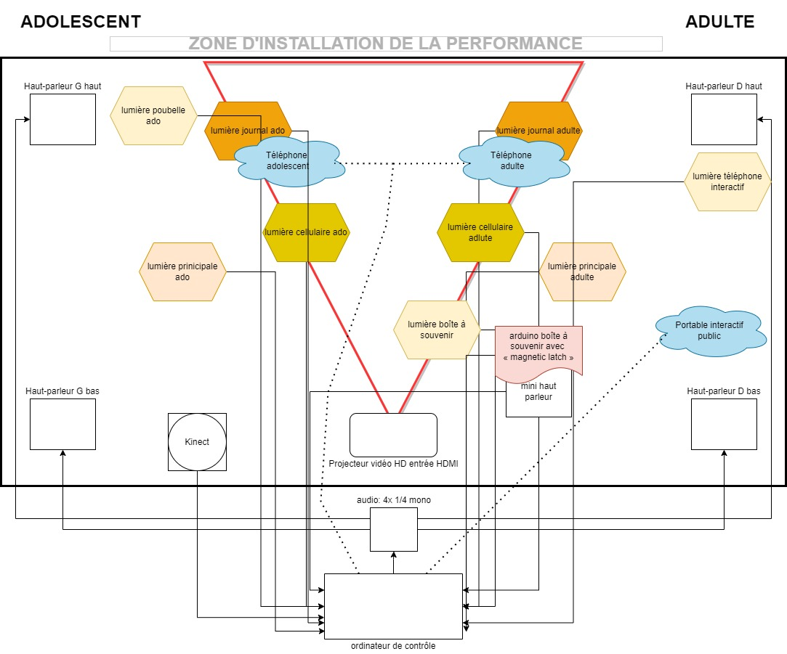

### Schéma de branchement 

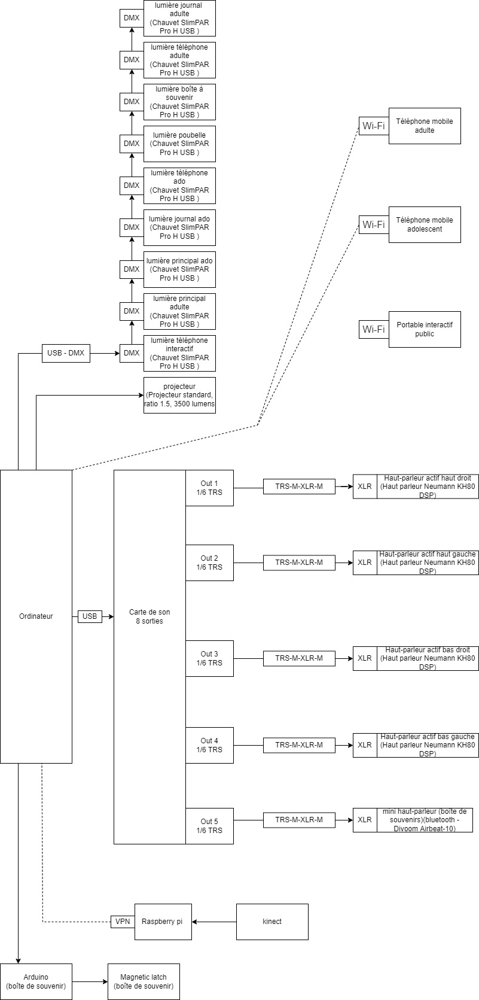

## Matériel de scénographie requis

> Liste des matériaux de scénographie (matériaux de décor) requis ou lien vers un tableur Excel ou document Markdown à part si nécessaire (quantité, spécifications techniques, lien vers fiche technique si applicable, commentaires...)

* Lit gonflabe
    * Queen
* Draps
    * Blanc pour adulte
    * Noir pour ado
* Oreiller
    * Même couleur que les draps
* Table de chevet 
    * 2 tables
* Journal
    * Bleu
    * Noir
* Boite de souvenir
    * Assez grande pour insérer des objets
    * Photos
    * Billets de concert
* Plantes
* Poubelle
    * Noir avec trou
    * Pansement
    * Examen
    * Devoirs
    * Notes
* Téléphone
    * Iphone 6s
    * 1 autres téléphone 
* Lampe
* Vêtements
* Déchets
    * Bouteille vide
    * Papier
* Table pour téléphone public

    

## Équipements requis
> Liste des équipements requis par département ou lien vers un tableur Excel ou document Markdown à part si nécessaire (quantité, spécifications techniques, lien vers fiche technique si applicable, commentaires...)

* Audio
    * 4 haut-parleurs (Haut parleur Neumann  KH80 DSP)
    * 4 Câble XLR 25'
    * 1 mini haut-parleur (Petit speaker portable / bluetooth - Divoom Airbeat-10)

* Vidéo
    * 1 projecteur vidéo lentille standard (Projecteur standard, ratio 1.5, 3500 lumens)
    * 1 système d'acrochage (Câble de sécurité)
    * Caméra (go pro)

* Lumière
    * 9 spots de lumière (chauvet slimPAR Pro H USB)
    * 9 fils XLR 

* Électricité
    * 2 extentions (Extension électrique)

* Réseau

* Ordinateur
    * 1 ordinateur
    * Ordinateur portable PC
    
* Autre
    * Kinect V2 + Adapteur pour PC
    * Photorésistance
    * Arduino nano
    * Moteur robot

## Logiciels requis
> Liste des logiciels requis, version ainsi que leurs dépendences

* [Max 8](https://cycling74.com/products/max)   
* [Visual studio code](https://code.visualstudio.com) 
* [Arduino](https://www.arduino.cc)  
* [Xd](https://www.adobe.com/ca/products/illustrator.html) 
* [Illustrator](https://www.adobe.com/ca/products/xd.html)   
* [After effect](https://www.adobe.com/ca/products/aftereffects.html)   
* [Reaper](https://www.adobe.com/ca/products/aftereffects.html)   
* [Davinci resolve](https://www.blackmagicdesign.com/products/davinciresolve/)
* [OSC for OBS](https://obsproject.com/forum/resources/osc-for-obs-app.1222/)
* [Photoshop](https://www.adobe.com/ca/products/photoshop.html)
* [QLC](https://www.qlcplus.org/)
* [Pure Data](https://puredata.info/)

## Ressources humaines requises
> Formaté en liste ou en lien vers un tableur Excel.

* TTP, location de matériel
* Actrice
* Doubleur père et doubleur Sasha
* Plusieur doubleurs pour iles 4 camarades et le professeur

## Ressources spatiales requises (rangement et locaux)
> Spécifications des espaces nécessaires formaté en liste ou lien vers un tableur Excel.

* Grand studio
    * Projection vidéo sur un mur blanc
    * Enregistrement vidéo

* Petit studio
    * Enregsitrement audio

## Contraintes techniques et potentiels problèmes de production
> Tableau ou lien vers un tableur Excel (contraintes, problème et solution envisagée, commentaires...)

| Contrainte ou problème potentiel                 | Solution envisagée                                    | Commentaires                                                                                 |
|--------------------------------------------------|-------------------------------------------------------|----------------------------------------------------------------------------------------------|
| Nous n'avons jamais utilisé un outil pour automatiser des éléments | Formation avec Guillaume dans le cours de conception de projet | Pour la projection et lumières |
| Nous n'avons jamais envoyé des messages signaux à un site web | Formation avec Thomas dans le cours d'espace intéractif | Pour faire partir le UI du téléphone |
| Nous n'avons jamais utilisé de la spacialisation sonore | Formation avec Guillaume dans le cours de conception de projet | Travailler avec 4 haut-parleurs |
| Nous n'avons jamais récolter des données d'un site pour les projeter | Formation avec Daryl dans le cours de gestion de projet | Faire changer une vidéo avec les réponses des gens précédents |
| Nous n'avons jamais sécuriser de téléphone cellulaire | Trouver des cables anti-vols | Sécuriser tous les téléphones |
| Risque qu’il n’y ait pas assez de lumière ou d’ombre pour la photorésistance de la boîte à musique.  | Un délai qui va être mis dans le code de la boite à souvenir pour que l’expérience puisse continuer quoi qu’il arrive. | Avoir un bonne luminosité est préférable pour l'expérience |
| Risque que le public ne s’approche pas du cellulaire à temps pour voir les notifications | Laisser un peu de temps entre les notifications et l’appel. | Sinon, faire comprendre aux participants ce qui c’est passé via l’audio qui va sortir de celui-ci. |
| Risque que le public ne va pas à l'ordinateur pour interagir avec l’interface. | Projeter un message sur le mur incitant le public à envoyer un message d’encouragement à Sasha ou sur l’écran de l’ordinateur (Ex: Envoyer un mot d’encouragement à Sasha!) | Projection est la solution plus idéale! |
| Risque que le public écrive des mots de profanation.| On peut soit avoir déjà des mots d'encouragement listé sur la page du site Web et le public peut choisir lesquels ils veulent envoyer OU on peut bloquer l’entrée de certains mots! | Bloquer des mots est la solution plus idéale!
|  Risque que le public n'ait pas assez de temps pour répondre au téléphone|Faire plusieurs simulations avec des volontaires pour trouver la durée de sonnerie nécessaire. Sinon, l’appelle sera dirigée vers la boîte vocale | On manque des appels en vrai vie aussi !|
Risque que le public vole, déplace ou salit nos décors et objets.|Afficher des pancartes à l’entrée et à la sortie de l’installation afin de rappeler le public de replacer les décors et objets et de ne pas salir l’installation. Aussi, des câbles de sécurité seront utilisés pour les objets de haute valeur.|Ne pas utiliser des objets qui nous tiennent à coeur|
|

# Planification de la production d'un prototype (budget et étapes de réalisation)
## Budget prévisionnel
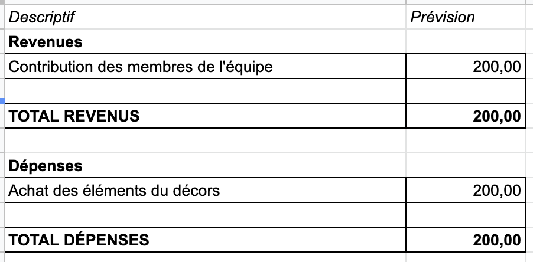

[Lien vers document](https://docs.google.com/spreadsheets/d/10EHdmBSzU-OB_hyH35pAxTp1Wx2cfQC5J625wcHOGkE/edit?usp=sharing)

## Échéancier global
Étapes importantes du projet visualisé dans GitHub (*milestones*):  
https://github.com/task-tim/temps/milestones

*Dates importantes :*
- Générale technique : lundi 21 mars;
- Début de la diffusion et pratique générale : mardi 22 mars (durant La Ruche, devant la communauté TIM);
- Diffusion des projets en mode autonome (prévoir une personne joignable en tout temps): mardi 22 au 28 mars 15h;
- Présentation aux étudiant.es de l'UQAM et aux étudiant.es de 1re: mercredi 23 mars;
- Vernissage devant public : jeudi 24 mars (soir);
- Présentation Semaine des arts: lundi 28 mars;
- Démontage: lundi 28 mars 15h.

## Liste des tâches à réaliser
Visualisation des tâches à réaliser dans GitHub selon la méthode Kanban:  
https://github.com/task-tim/temps/projects/1

Inventaire des tâches à réaliser dans GitHub selon le répertoire d'*issues*:  
https://github.com/task-tim/temps/issues

## Rôles et responsabilités des membres de l'équipe
> Il vous est proposé ici de nommer une personne à la coordination générale du projet, à la coordination technique et à la coordination artistique. Les grandes décisions sur les grandes orientations du projet devraient se prendre en groupe lors de rencontres d'équipe. Cependant, les décisions entre vos rencontres de groupe devraient appartenir à ces personnes.

**Étudiant Trish**
- Coordination de communication 
- Création de la maquette de l'interface mobile
- Montage des paysages sonores
- Coudre les couvertures ensemble
- Création des éléments visuels de la conclusion

Liste des tâches dans Git Hub:  
https://github.com/task-tim/temps/issues?q=assignee%3ATrishng
https://github.com/task-tim/temps/projects/1?card_filter_query=assignee%3Atrishng

**Étudiant Angie**
- Coordination artistique 
- Création des vidéos d'animation 2D 
- Programmation de la boîte à souvenir

Liste des tâches dans Git Hub:  
https://github.com/task-tim/temps/issues?q=assignee%3Aangelinajeca
https://github.com/task-tim/temps/projects/1?card_filter_query=assignee%3Aangelinajeca

**Étudiant Sabrina**
- Coordination technique
- Décoratrice intérieur
- Écrire les journaux
- Montage des vidéos
- Filmer les vidéos
- Prendre les photos
- Enregistrement des voix

Liste des tâches dans Git Hub:  
https://github.com/task-tim/temps/issues?q=assignee%3Asabrinakayani
https://github.com/task-tim/temps/projects/1?card_filter_query=assignee%3Asabrinakayani

**Étudiant Karine**
- Coordination générale
- Programmation des interfaces mobiles
- Programmation de l'interface de soumission de message
- Décoration de la boîte à souvenir
- Programmation de la timeline

Liste des tâches dans Git Hub:  
https://github.com/task-tim/temps/issues?q=assignee%3ACorKarine
https://github.com/task-tim/temps/projects/1?card_filter_query=assignee%3Acorkarine

**Tâches pas encore attribuées**  
https://github.com/task-tim/temps//issues?q=is%3Aopen+is%3Aissue+no%3Aassignee

## Moments des rencontres d'équipe

Quotidien
- **11h (15min)** : Petites rencontres (mêlées) entre les coéquipiers.

Hebdomadaire
- **Mardi 8h55 (2h)** : Rencontre du comité de communication.
- **Mardi 11h00 (1h-2h)** : Rencontre de suivi de projet entre les coéquipiers.
- **Mercredi 9h50 (1h)** : Rencontre de suivi de projet avec les profs.
- **Jeudi 8h55 (2h)** : Rencontre du comité technique.

