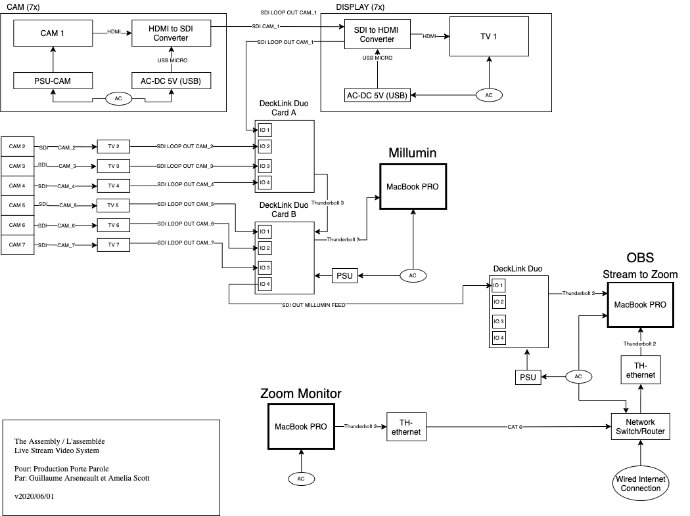
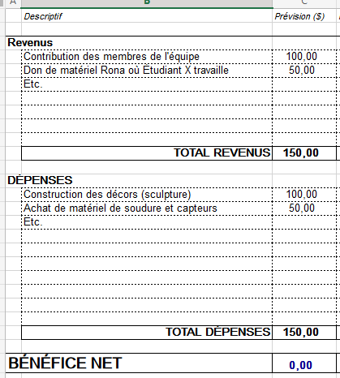

# Préproduction
> C'est ici qu'on dépose les éléments de la préproduction.

# Table des matières
1. [Intention ou concept](#Intention-ou-concept)
    - [Cartographie](#Cartographie)
    - [Intention de départ](#Intention-de-départ)
    - [Synopsis](#Synopsis)
    - [Tableau d'ambiance (*moodboard*)](#Tableau-d'ambiance-(*moodboard*))
    - [Scénario, scénarimage ou document audio/visuel](#Scénario,-scénarimage-ou-document-audio/visuel)
2. [Planification technique d'un prototype (devis technique)](#Planification-technique-(devis-technique))
    - [Schémas ou plans techniques](#Schémas-ou-plans-techniques)
    - [Matériaux requis](#Matériaux-de-scénographie-requis)
    - [Équipements requis](#Équipements-requis)
    - [Logiciels requis](#Logiciels-requis)
    - [Ressources humaines requises](#Ressources-humaines-requises)
    - [Ressources spatiales requises (rangement et locaux)](#Ressources-spatiales-requises-(rangement-et-locaux))
    - [Contraintes techniques et potentiels problèmes de production](#Contraintes-techniques-et-potentiels-problèmes-de-production)
3. [Planification de la production d'un prototype (budget et étapes de réalisation)](#Planification-de-la-production-(budget-et-étapes-de-réalisation))
    - [Budget prévisionnel](#Budget-prévisionnel)
    - [Échéancier global](#Échéancier-global)
    - [Liste des tâches à réaliser](#Liste-des-tâches-à-réaliser)
    - [Rôles et responsabilités des membres de l'équipe](#Rôles-et-responsabilités-des-membres-de-l'équipe))
    - [Moments des rencontres d'équipe](#Moments-des-rencontres-d'équipe)

# Intention ou concept
## Cartographie

## Intention de départ
Par ce projet, nous souhaitons exposer comment la vie d'une personne LGBTQ+ entourer de parents non suportifs peut changer au fil du temps. Aussi, on veux exposer comment une personne en soi peut changer au cours du temps, mais cette personnne n'a pas de contrôle sur le changement de convictions des personnes autour d'elle. 

## Synopsis
Sasha adolescente et Sasha adulte vivent leur vie. Durant son adolescence, Sasha se fait négliger par ses parents et cela affecte sa santé mentale. Pendant sa vie d'adulte, Sasha habite maintenant seule, Sasha s'accepte, mais ses parents sont toujours contre elle . Cependant, Sasha porte mieux mentalement qu'avant. 

Le public est appelé à découvrir que les deux vies projetées devant eux sont différents passages de la vie d'une seule et même personne.

## Tableau d'ambiance (*moodboard*)
> Moodboard chambre adolescent

Lit adolescent

Journal adolescent

Poubelle adolescent

Ambiance sonore adolescent

> Moodboard chambre adulte

Lit adulte

Journal adulte

Boite de souvenir adulte

Plante adulte

Ambiance sonore adulte

* Ville: https://artlist.io/sfx/track/70925/the-recordist---city-street,-ac-whirring,-traffic-rumble
* Radio: https://www.youtube.com/watch?v=Erf2iFHG44M
* Ventilateur: https://lasonotheque.org/detail-0078-ventilateur.html
* Amis: https://artlist.io/sfx/track/42040/ambiences-vol-1---crowded-cafeteria,-people-talking,-eating
* Défilé: https://www.youtube.com/watch?v=S-kRJQFq55g
* Électroménager: https://artlist.io/sfx/track/70073/rooms-presence---industrial-kitchen,-fridge-section,-humming-loudly-

## Scénario, scénarimage ou document audio/visuel

**SCÈNE INTRODUCTION**

Les deux sections de la chambre sont allumés, de plus les lumières par dessus les 6 objects sont allumés. Le public entre dans la chambre. Un lit est au milieu de la pièce, celui- ci est séparé en deux sections et une table de chevet se retrouve de chaque côté. La section gauche représente la chambre de Sacha adolescente (16 ans) et la section droite représente la chambre adulte de Sasha. Après quelques temps, toutes les lumières s'éteignent.

**SCÈNE 01 ADOLESCENTE**

La section adolescente de la chambre s’illumine. Le public est amené à observer les deux sections pendant une minute. Après, le téléphone fait un son de notification et s’illumine. Cet événement amène le public à se rapprocher de la table de chevet de la section gauche (côté adolescente) et interagir avec l’appareil. 

Sur l’appareil, on voit apparaître des notifications de messages textes en temps réel. Après quelques temps, le téléphone reçoit un appel téléphonique du père de Sasha et le public a le choix de soit répondre au téléphone ou ignorer l’appel:

S'il répond: Le père de Sasha la réprimande avec un ton agressif sur sa sexualité.

PÈRE: Sasha! Comme ça j'ai appris que t'es lesbienne! C'est un péché, tu va etre puni pour tes tors. Essaye pas de t'expliquer, pourquoi tu peux pas être normale comme les autres! T'est plus ma fille, j'ai honte de t'avoir eu... C'est tu a cause de la maniere que je t'ai élever? Sasha, je suis.

L'appel se termine, on entend la ligne qui se coupe.

S’il ignore: Le téléphone arrête de sonner après 30 secondes et la boîte vocale est activée où on peut entendre le père de Sasha se plaindre qu’elle ne répond jamais au téléphone et la réprimande avec un ton agressif sur sa sexualité.

PÈRE : Sasha comment ça tu répond pas, je sais que tu m'entend! Comme ça j'ai appris que t'es lesbienne! C'est un péché, tu va etre puni pour tes tors. Essaye pas de t'enfuir, ce soir va falloir qu'on ce parle, pourquoi tu peux pas être normale comme les autres tabarnack!

Le message vocal se termine, on entend la ligne qui se coupe.

**SCÈNE 02 ADOLESCENTE**

Soudainement, la poubelle dans la chambre de Sasha se fait renverser.
Le public est invité à observer les ordures (pansements, devoirs froissés, examen coulé, messages haineux sur papiers froissés) se trouvant sur le plancher. Après quelques secondes, une vidéo est déclenchée et projetée sur le mur de la pièce. 

Dans la vidéo, on voit la perspective de Sasha qui entre dans sa chambre et commence à mettre les ordures dans la poubelle. À ce moment, on peut entendre les insultes et réprimandes de ses camarades de classe et les inquiétudes de son professeur.

CAMARADE 1 : Eille c'est la lesbienne!
Les cammarades commence a rire et des chuchotement incompréensible peuvent être entendu.
CAMARADE 2 : Ah peut-tu sortir des toilettes, je ne suis pas confortable.
CAMARADE 3 : Oh comme c'est domage, tu est tellement belle.
CAMARADE 4 : Ark je pensait qu'elle avait un oeuil sur moi.
PROFESSEUR : Qu'est-ce qui se passe, pourquoi tes notes descendent.

**SCÈNE 03 ADOLESCENTE**

Lorsque la vidéo termine, la lampe sur la table à chevet s’allume et illumine le journal intime de Sasha. Le public est invité à lire le journal. Pendant que le public lit le journal, on entend la voix de Sasha qui fait la lecture de son journal.

SASHA ADO : Chère Sasha, ajourd'hui les élèves de ma classe ont découvert la vérité, même le professeur le sait. Quand j'ai reçu mon examen (que j'ai coulé XD), il ma demandait si j'avais besoin d'aide. C'est gentil de sa part, mais j'ose pas aller le voir, c'est pas comme si il peut empêcher toute la classe de se moquer de moi. Ils ont lancer mon sac-à-dos dans les toilettes, heureusement mon lunch a été épargnié. Mes parents étaient trop occupé pour remarquer quoi que ce soit. Aussi, la fille que j'aimai, ma insulter. Personne est de mon bord, si seulement j'étais normale.

**SCÈNE 04 ADULTE**

Le côté adolescent s’éteint et la lumière du côté adulte illumine le côté droit de la pièce. Une boîte de souvenirs est située sur la table de chevet. Du son commence à sortir de celle-ci pour amener le public à ouvrir la boîte. Après son ouverture, le son est arrêté et, quelques secondes après, une vidéo est déclenchée sur le mur de la pièce. Dans la vidéo, on voit la perspective de Sasha qui met les souvenirs dans la boîte et commence à décorer sa chambre et elle dépose un journal sur son lit.

**SCÈNE 05 ADULTE**

Le public est invité à lire le journal. Pendant que le public lit le journal, on entend la voix de Sasha qui fait la lecture de son journal.

SASHA ADULTE : Chère Sasha, demain j'ai un deuxième rendez-vous avec la fille que j'ai rencontré en ligne. J'ai pas encore choisie mon habit, mais j'ai hâte de la voir. Ajourd'hui, c'est le cinquième anniversaire de mon déménagement, c'est bien d'être libre. La jeune Sasha serait fier de moi.

**SCÈNE 06 ADULTE**

Le téléphone reçoit un appel téléphonique du père de Sasha et le public a le choix de soit répondre au téléphone ou ignorer l’appel:

S'il répond: Le père de Sasha lui parle avec un ton passif agressif.

PÈRE : Ah tu te souviens comment décrocher le téléphone. C'est bientôt la fête de ta mère ça serait bien que pour une fois tu passe la voir. On peut mettre nos différence de côté pendant une journée. Tu devrait te forcer pour nous pardonner, on ta tous donner. Je t'aime, mais je ne peux pas accepter ton mode de vie.

S’il ignore: Le téléphone arrête de sonner après 30 secondes et la boîte vocale est activée où on peut entendre le père de Sasha se plaindre qu’elle ne répond jamais au téléphone et lui demande de venir lui rendre visite de temps en temps et de ne pas le blâmer pour ses convictions.

PÈRE : Ah ta pas appris comment décrocher le téléphone. Ça serait bien que tu vienne nous visiter de temps en temps. Tu sais c'est pas de notre faute, tu devrait pas nous blamer pour nos convictions. Quand t'aura fini cette phase, tu va nous comprendre. Viens bientôt nous rendre visite.

**SCÈNE CONCLUSION**

Toutes les lumières s'éteignent, une projection commence, on y voit une interface de message cellulaire. Sasha adolescent commence à parler et Sasha adulte lui répond.

Pour chaque dialogue, un nouveau message va apparaitre à l'écran.

SASHA ADO : Salut, comment ça va?

SASHA ADULTE : Ça va mieux.

SASHA ADO : Habite tu encore avec nos parents?

SASHA ADULTE : Non, j'ai enfin déménager.

SASHA ADO : Est-ce que maman et papa ont fini par m'accepter?

SASHA ADULTE : Pas vraiment, mais ils nous tolerent.

SASHA ADO : Es-tu heureuse?

SASHA ADULTE : Ya des journées qui sont plus difficile, mais on va y arriver.

SASHA ADO : On es-tu bien dans notre peau?

SASHA ADULTE : Ça ma pris du temps à m'accepter, mais je suis fier de qui je suis.

Le projecteur s'éteind lentement après la dernière phrase.

# Planification technique d'un prototype (devis technique)
## Schémas ou plans techniques
> Insérer plans, documents et schémas pertinents dans cette sectio.  

### Plantation 

### Schéma de branchement 

## Matériel de scénographie requis

> Liste des matériaux de scénographie (matériaux de décor) requis ou lien vers un tableur Excel ou document Markdown à part si nécessaire (quantité, spécifications techniques, lien vers fiche technique si applicable, commentaires...)

* Divan Louis XIV
    * Couleur rouge
    * 12' x 4' x 3'
* Cyclorama

## Équipements requis
> Liste des équipements requis par département ou lien vers un tableur Excel ou document Markdown à part si nécessaire (quantité, spécifications techniques, lien vers fiche technique si applicable, commentaires...)

* Audio
    * 8 haut-parleurs actifs de 4"
    * 8 fils XLR 3 conducteurs de 15' (M->F)
    * Interface audio USB disposant 8 sorties 

* Vidéo
    * 2 projecteurs vidéo lentille standard
    * 2 système d'acrochage
    * 3 webcam logitech c920

* Lumière
    * 4 lumière LED RGBAW DMX
    * 4 fils XLR 3 conducteurs de 20'
    * Console DMX
    * Interface DMX USB

* Électricité
    * 8 cordon IEC (pour l'alimentation des haut-parleurs)
    * 2 extentions 3 fiches et 3 conducteurs 
    * 2 multiprise

* Réseau
    * 4 fils cat6a de 15"
    * Switch poe 5 ports

* Ordinateur
    * 1 ordinateur portable 
    
* Autre
    * Tout autre élément pertinant

## Logiciels requis
> Liste des logiciels requis, version ainsi que leurs dépendences

* [nodeJS 14.15.4 LTS](https://nodejs.org/en/) 
    * [node-osc](https://github.com/MylesBorins/node-osc)
* [Max 8](https://cycling74.com/products/max)   
* [Unity 2019 lts](https://unity.com/)
* [Open stage control](https://openstagecontrol.ammd.net/)

## Ressources humaines requises
> Formaté en liste ou en lien vers un tableur Excel.

* TTP, location de matériel
* Personne X, performeuse
* Etc.

## Ressources spatiales requises (rangement et locaux)
> Spécifications des espaces nécessaires formaté en liste ou lien vers un tableur Excel.

* Grand studio
    * Projection vidéo dans le cyclo
    * Capatation vidéo

* Petit studio
    * Enregsitrement audio

## Contraintes techniques et potentiels problèmes de production
> Tableau ou lien vers un tableur Excel (contraintes, problème et solution envisagée, commentaires...)

| Contrainte ou problème potentiel                 | Solution envisagée                                    | Commentaires                                                                                 |
|--------------------------------------------------|-------------------------------------------------------|----------------------------------------------------------------------------------------------|
| Nous n'avons jamais utilisé la caméra 360 degrés | Formation avec TTP, expérimentation durant la session | Sinon, nous pourrions tourner avec une caméra normale et ajuster notre projet en conséquence |
|                                                  |                                                       |                                                                                              |

# Planification de la production d'un prototype (budget et étapes de réalisation)
## Budget prévisionnel

[Lien vers document](https://cmontmorency365.sharepoint.com/:x:/s/TIM-58266B-Expriencemultimdiainteractive-Enseignants/ERS3zx4iKAlLn03N_0h3cyQBOV_nxNuKvrKnqmrXGcgDYg?e=Rjq9Uc)

## Échéancier global
Étapes importantes du projet visualisé dans GitHub (*milestones*):  
https://github.com/tim-montmorency/66B-modele_de_projet/milestones

*Dates importantes :*
- Première itération : lundi x novembre
- Prototype finale : lundi x décembre
- Présentation des projets devant public : jeudi 25 mars (soir)

## Liste des tâches à réaliser
Visualisation des tâches à réaliser dans GitHub selon la méthode Kanban:  
https://github.com/tim-montmorency/66B-modele_de_projet/projects/2?add_cards_query=is%3Aopen

Inventaire des tâches à réaliser dans GitHub selon le répertoire d'*issues*:  
https://github.com/tim-montmorency/66B-modele_de_projet/issues

## Rôles et responsabilités des membres de l'équipe
> Il vous est proposé ici de nommer une personne à la coordination générale du projet, à la coordination technique et à la coordination artistique. Les grandes décisions sur les grandes orientations du projet devraient se prendre en groupe lors de rencontres d'équipe. Cependant, les décisions entre vos rencontres de groupe devraient appartenir à ces personnes.

**Étudiant E**
- Coordination générale du projet (coordination de l'échéancier, du budget, suivi de la liste des tâches à réaliser, s'assurer de la répartition du rôle et des responsabilités des membres de l'équipe);
- Création du module d'interprétation des données;
- Programmation du module Max de contrôle vidéo.

Liste des tâches dans Git Hub:  
https://github.com/tim-montmorency/66B-modele_de_projet/issues/assigned/DarylMomo  
https://github.com/tim-montmorency/66B-modele_de_projet/projects/2?card_filter_query=assignee%3Adarylmomo

**Étudiant D**
- Comité Technique et coordination technique (suivi du devis technique);
- Création des paysages sonores sonores;
- Programmation du module Max d'effet et de contrôle audio;
- Installation de l'équipement dans l'espace physique.

Liste des tâches dans Git Hub:  
https://github.com/tim-montmorency/66B-modele_de_projet/issues/assigned/gllmAR
https://github.com/tim-montmorency/66B-modele_de_projet/projects/2?card_filter_query=assignee%3Agllmar

**Étudiant C**
- Installation et mise en place de la capture audiovidéo du projet en temps réel;
- Programmation du module de captation des données;
- Programmation du module de diffusion et d'interaction en ligne (page Web, diffusion vidéo dans Twitch via OBS, interface utilisateur dans Open Stage Control).

Liste des tâches dans Git Hub:  
https://github.com/tim-montmorency/66B-modele_de_projet/issues/assigned/DarylMomo  
https://github.com/tim-montmorency/66B-modele_de_projet/projects/2?card_filter_query=assignee%3Adarylmomo

**Étudiant B**
- Coordination artistique (attention plus particulière pour s'assurer que l'intention/concept artistique du projet initial reste, sinon consulter les membres de l'équipe);
- Création des textes poétiques;
- Création des vidéos d'animation 2D;
- Programmation du module Unity d'effets visuels et intégration dans Max.

Liste des tâches dans Git Hub:  
https://github.com/tim-montmorency/66B-modele_de_projet/issues/assigned/gllmAR
https://github.com/tim-montmorency/66B-modele_de_projet/projects/2?card_filter_query=assignee%3Agllmar

**Étudiant A**
- Création des images;
- Création des icônes de navigation;
- Programmation du module Max d'éclairage;
- Programmation du module Max de contrôle de la navigation utilisateur & des différents sous-modules.

Liste des tâches dans Git Hub:  
https://github.com/tim-montmorency/66B-modele_de_projet/issues/assigned/DarylMomo  
https://github.com/tim-montmorency/66B-modele_de_projet/projects/2?card_filter_query=assignee%3Adarylmomo

**Tâches pas encore attribuées**  
https://github.com/tim-montmorency/66B-modele_de_projet/issues?q=is%3Aopen+is%3Aissue+no%3Aassignee

## Moments des rencontres d'équipe
Hebdomadaire
- **"y" jour "x"h (1h-2h)** : Rencontre de suivi de projet.

Autre: 
- **"y" jour "x"h (1h-2h)** : Rencontre de suivi de projet.
